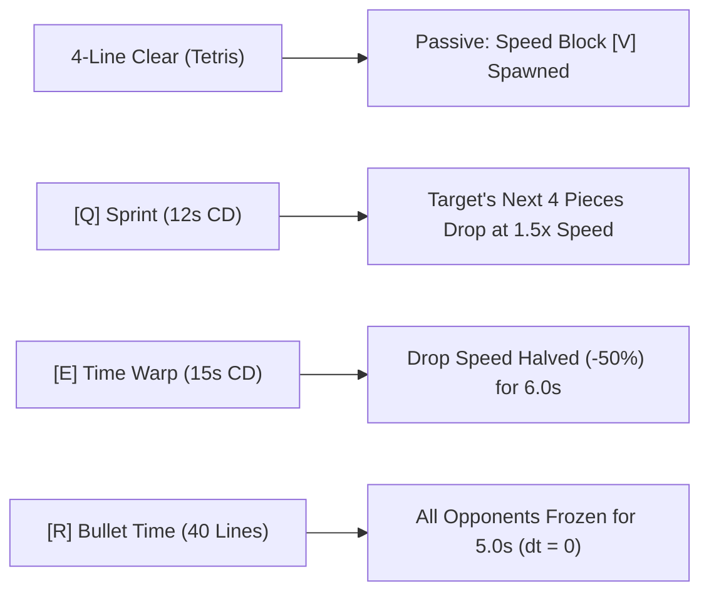
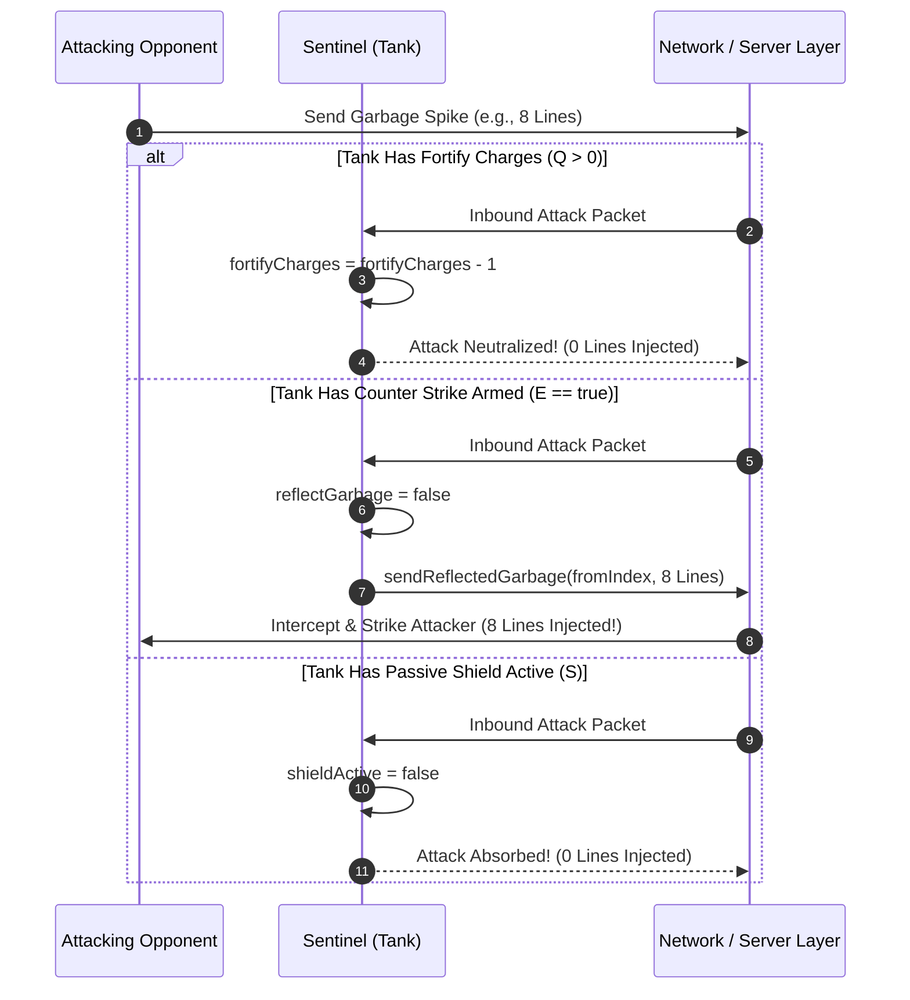
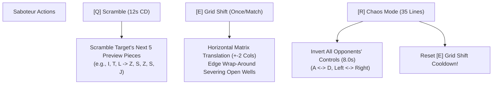
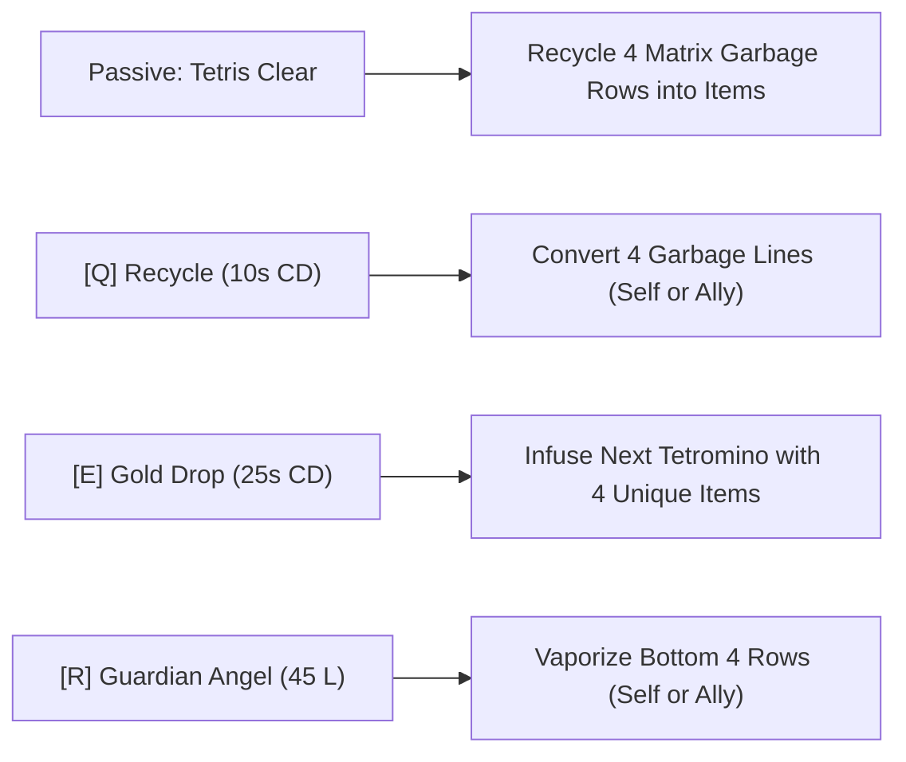
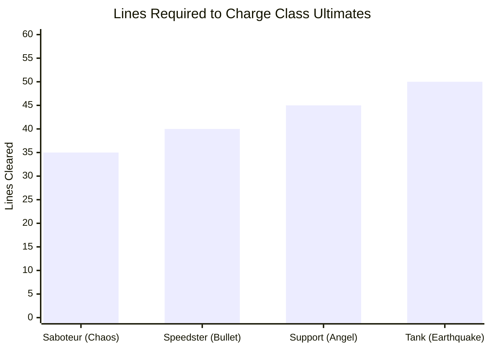

# Hero Class Archetype System & Competitive Combat Balance in *Cascade Aurelius*

---

## 1. Executive Summary & Design Philosophy

Classical competitive falling-block puzzle games operate almost exclusively within a symmetrical, homogenous mechanical framework: every participant possesses identical kinematic properties, equal piece-generation probability distributions, and identical options for dealing with incoming garbage. While this ensures pure parity, it inherently limits strategic depth, role specialization, and emergent team dynamics.

*Cascade Aurelius* shatters this homogeneity by introducing an **Asymmetric Hero Class Archetype System**. Players select from four mechanically distinct classes—**Speedster**, **Sentinel (Tank)**, **Saboteur**, and **Support**—each built upon dedicated tactical roles:

```
+-----------------------------------------------------------------------------------+
|                        CASCADE AURELIUS HERO CLASS TAXONOMY                       |
+---------------------+-------------------+-------------------+---------------------+
| SPEEDSTER           | SENTINEL (TANK)   | SABOTEUR          | SUPPORT             |
| Role: Tempo/Rusher  | Role: Anchor/Def  | Role: Disruption  | Role: Utility/Sustain|
+---------------------+-------------------+-------------------+---------------------+
| Passive: Speed [V]  | Passive: Shield[S]| Passive: Freeze[F]| Passive: Recycle    |
| [Q]: Sprint (12s)   | [Q]: Fortify (10s)| [Q]: Scramble(12s)| [Q]: Recycle (10s)  |
| [E]: Time Warp(15s) | [E]: Reflect (20s)| [E]: Shift (Match)| [E]: Gold Drop (25s)|
| [R]: Bullet (40 L)  | [R]: Quake (50 L) | [R]: Chaos (35 L) | [R]: Angel (45 L)   |
+---------------------+-------------------+-------------------+---------------------+
```

Each archetype is governed by four foundational design pillars:
1. **Passive Awakening:** A 4-line clear (Tetris) guarantees a class-specific Special Block on the subsequent piece or triggers automated board transmutation.
2. **Tactical Micro-Abilities ($[\text{Q}]$ and $[\text{E}]$):** Low-to-medium cooldown skills providing localized micro-advantages, hazard mitigation, or offensive harassment.
3. **Line-Charged Ultimate ($[\text{R}]$):** Macro-impact game-changers charged through cumulative line clears rather than passive timers.
4. **Cross-Mode Asymmetry:** Mechanics dynamically adapt between 1v1 duels, 3v3 Team Deathmatch squad play, and 30-player Battle Royale survival.

---

## 2. Comprehensive Class Archetype Taxonomy

Implemented across [`src/PlayerClass.ts`](file:///c:/Users/destr/Documents/Cascade-Aurelius/Prototype%20V1/src/PlayerClass.ts), [`src/Player.ts`](file:///c:/Users/destr/Documents/Cascade-Aurelius/Prototype%20V1/src/Player.ts), and [`src/GameManager.ts`](file:///c:/Users/destr/Documents/Cascade-Aurelius/Prototype%20V1/src/GameManager.ts), each class represents a unique mathematical solution to puzzle combat.

### 2.1 Class Specification Matrix

| Metric / Dimension | Speedster | Sentinel (Tank) | Saboteur | Support |
| :--- | :--- | :--- | :--- | :--- |
| **Tactical Role** | Tempo Rusher / Precision | Defensive Anchor / Reflector | Tactical Disruptor / Harasser | Team Utility / Transmuter |
| **Class Icon** | `/class/Speedster.png` | `/class/Sentinel.png` | `/class/Saboteur.png` | `/class/Support.png` |
| **Signature Color** | Neon Cyan (`#00E5FF`) | Emerald Green (`#00FF88`)| Magenta (`#FF1493`)| Amber Gold (`#FFD700`) |
| **Tetris Passive** | Guarantees **Speed Block [$\text{V}$]** | Guarantees **Shield Block [$\text{S}$]** | Guarantees **Freeze Block [$\text{F}$]** | Recycles 4 garbage lines into items |
| **Ability [Q]** | **Sprint** ($12.0\text{s}$ CD) | **Fortify** ($10.0\text{s}$ CD) | **Scramble** ($12.0\text{s}$ CD) | **Recycle** ($10.0\text{s}$ CD) |
| **Ability [E]** | **Time Warp** ($15.0\text{s}$ CD)| **Counter Strike** ($20.0\text{s}$ CD)| **Grid Shift** (Once/Match) | **Gold Drop** ($25.0\text{s}$ CD) |
| **Ultimate [R]** | **Bullet Time** | **Earthquake** | **Chaos Mode** | **Guardian Angel** |
| **Ultimate Cost** | **$40\text{ Lines}$** | **$50\text{ Lines}$** | **$35\text{ Lines}$** | **$45\text{ Lines}$** |

---

## 3. In-Depth Class Mechanics & Mathematical Modeling

### 3.1 Speedster: Kinematic Acceleration & Temporal Dilation

The Speedster manipulates gravitational constants and piece descent velocity ($\Delta t_{\text{drop}}$).



#### 1. Passive: Speed Block [$\text{V}$]
Executing a Tetris invokes:
```typescript
player.itemManager.applySpecificItemToTetromino(player.nextPiece, SpecialBlockType.SPEED);
```
When locked in a completed row, it extends `dropInterval` by $2.0\times$ for $5.0\text{s}$, giving the Speedster precision micro-control.

#### 2. Ability [Q]: "Sprint"
Targets an opponent and applies kinematic acceleration to their active and queued pieces:
$$\Delta t_{\text{drop, opponent}} \leftarrow \max\left(50\text{ ms}, \; \left\lfloor \frac{\Delta t_{\text{drop, opponent}}}{1.5} \right\rfloor \right) \quad \text{for } 4 \text{ pieces}$$
Forces opponent misdrops during critical downstacking maneuvers.

#### 3. Ability [E]: "Time Warp"
A defensive temporal buffer when approaching the top-out ceiling ($H \ge 14$):
$$\Delta t_{\text{drop, self}} \leftarrow \Delta t_{\text{drop, self}} \cdot 2.0, \quad T_{\text{warp}} = 6{,}000\text{ ms}$$

#### 4. Ultimate [R]: "Bullet Time" (Cost: $40\text{ Lines}$)
The Speedster locks all opponent boards in global stasis:
$$\forall p \in \text{Opponents}: \quad p.\text{quicksilverTimer} \leftarrow 5{,}000\text{ ms} \implies \frac{d}{dt}(\text{Opponent Simulation}) = 0$$
While rivals are frozen, the Speedster continues playing at full speed, allowing uninhibited downstacking and uninterrupted attack volleys.

---

### 3.2 Sentinel (Tank): Attrition Defense & Kinetic Reflection

The Sentinel is engineered to neutralize burst damage and punish aggressive opponents.



#### 1. Passive: Shield Block [$\text{S}$]
Guarantees a Shield mino on the next piece following a Tetris. When cleared, raises a persistent defensive aura that absorbs an entire incoming garbage packet regardless of magnitude.

#### 2. Ability [Q]: "Fortify" ($10.0\text{s}$ CD)
Grants two absolute immunity charges:
$$\text{fortifyCharges} \leftarrow 2$$
When incoming garbage arrives, if $\text{fortifyCharges} > 0$, the packet is deleted without affecting matrix state:
$$\text{fortifyCharges} \leftarrow \text{fortifyCharges} - 1, \quad \mathcal{G}_{\text{injected}} = 0$$

#### 3. Ability [E]: "Counter Strike" ($20.0\text{s}$ CD)
Arms a reflection flag:
$$\text{reflectGarbage} \leftarrow \text{true}$$
The next incoming attack packet is captured, converted into an outgoing projectile, and dispatched back to the sender:
$$\text{sendReflectedGarbage}(\text{attackerId}, \; \mathcal{G}_{\text{incoming}})$$

#### 4. Ultimate [R]: "Earthquake" (Cost: $50\text{ Lines}$)
The heaviest ultimate in the game. Generates an unmitigated seismic shockwave delivering $+4$ raw garbage lines to every single opponent board simultaneously:
$$\forall p \in \text{Opponents}: \quad p.\text{grid.addGarbageLines}(4, \text{'HUMAN'})$$

---

### 3.3 Saboteur: Information Warfare & Structural Dislocation

The Saboteur excels at psychological disruption, queue manipulation, and stack fragmentation.



#### 1. Passive: Freeze Block [$\text{F}$]
A Tetris clear guarantees a Freeze Block [F]. When line-cleared, it fires a cybernetic beam locking the opponent's $[\text{Q}], [\text{E}], [\text{R}]$ abilities for $3.0\text{s}$.

#### 2. Ability [Q]: "Scramble" ($12.0\text{s}$ CD)
Replaces the target's predictable 7-bag preview queue with unfavorable, high-friction tetromino shapes:
$$\text{queue}_{\text{target}}[0..4] \leftarrow \big[ \text{'Z'}, \text{'S'}, \text{'J'}, \text{'Z'}, \text{'S'} \big]$$
Cripples the opponent's forward planning and flat-surface stacking.

#### 3. Ability [E]: "Grid Shift" (Once Per Match)
Shifts the opponent's locked matrix horizontally by $\pm 2$ columns with cyclic edge wrap-around:
$$\forall r \in [0, H - 1], \; c \in [0, W - 1]: \quad \text{matrix}'[r][c] = \text{matrix}[r]\big[(c - \Delta c + W) \bmod W\big]$$
Because Tetris players maintain an open well at Column 1 or Column 10, a 2-column shift moves the open well into Column 3 or Column 8, completely severing their line-clearing channel.

#### 4. Ultimate [R]: "Chaos Mode" (Cost: $35\text{ Lines}$)
Boasting the lowest ultimate cost in the game ($35$ lines $\approx 8.75$ Tetrises), Chaos Mode inverts all opponent movement inputs for $8.0\text{s}$:
$$\text{Input}_{\text{left}} \longleftrightarrow \text{Input}_{\text{right}}$$
Crucially, activating Chaos Mode **instantly resets [E] Grid Shift**, enabling a devastating double-shift combination.

---

### 3.4 Support: Threat Transmutation & Squad Recovery

The Support class converts hazardous pressure into positive game resources.



#### 1. Passive & Ability [Q]: "Recycle" ($10.0\text{s}$ CD)
Converts raw gray garbage lines into active special item blocks cycling sequentially through all 7 types:
```typescript
// Grid.ts: convertGarbageToSpecialBlocks()
public convertGarbageToSpecialBlocks(count: number): number {
  const specials = ['BOMB', 'HEAVY', 'MULTIPLIER', 'SPEED', 'SHIELD', 'FREEZE', 'GARBAGE_EATER'];
  let converted = 0;
  for (let r = this.height - 1; r >= 0 && converted < count; r--) {
    for (let c = 0; c < this.width && converted < count; c++) {
      const cell = this.matrix[r][c];
      if (cell.type !== 'GARBAGE' || cell.unClearable) continue;
      cell.type = 'I';
      cell.special = specials[converted % specials.length];
      converted++;
    }
  }
  return converted;
}
```

#### 2. Ability [E]: "Gold Drop" ($25.0\text{s}$ CD)
Constructs a quadruply-infused tetromino where every solid mino contains a distinct special block chosen via **Fisher-Yates shuffle**.

#### 3. Ultimate [R]: "Guardian Angel" (Cost: $45\text{ Lines}$)
Directly deletes up to 4 bottom garbage rows from the player's board, or an endangered teammate's board in 3v3 TDM:
$$\text{clearBottomLines}(4) \implies \text{cleared rows vaporized; remaining stack settles via applyGravity()}$$

---

## 4. Energy Economics & Meter Balancing

The energy economy dictates how frequently macro-impact abilities alter match momentum.

### 4.1 Meter Accumulation Curve

Ultimate energy does not charge passively over time. To reward mechanical skill and aggressive line-clearing, meter accumulation is governed strictly by **discrete line clears**:
$$M(t + \Delta t) = \min\big(M_{\text{cost}}, \; M(t) + L_{\text{cleared}}\big)$$



### 4.2 Mathematical Balancing Trade-offs

$$\begin{array}{|l|c|c|c|l|}
\hline
\textbf{Class Archetype} & M_{\text{cost}} & \textbf{Effective Tetrises} & \textbf{Target Scope} & \textbf{Balance Justification} \\
\hline
\textbf{Saboteur} & 35 & 8.75 & \text{Global Opponents} & \text{Control inversion is disruptive but non-lethal to expert players.} \\
\textbf{Speedster} & 40 & 10.00 & \text{Global Opponents} & \text{5s freeze guarantees 1-2 free Tetrises with zero counterplay.} \\
\textbf{Support} & 45 & 11.25 & \text{Targeted Ally / Self} & \text{4-line clean erase can overturn imminent top-out in high garbage.} \\
\textbf{Sentinel (Tank)} & 50 & 12.50 & \text{Global Opponents} & \text{+4 raw lines across all opponents is devastating in multi-man lobbies.} \\
\hline
\end{array}$$

---

## 5. Cross-Mode Asymmetry & Adaptive Targeting

The combat effectiveness of each class varies substantially across game modes. The engine applies dynamic targeting rules in [`GameManager.cycleClassTarget`](file:///c:/Users/destr/Documents/Cascade-Aurelius/Prototype%20V1/src/GameManager.ts#L1060-L1130):

### 5.1 1v1 Competitive Ranked Duels
- **Direct Parity:** All single-target abilities ($[\text{Q}]$ Sprint, $[\text{Q}]$ Scramble, $[\text{E}]$ Grid Shift) lock onto the sole opponent.
- **Tank Counter Strike Meta:** In 1v1, a Tank timing Counter Strike against a 4-line Tetris attack creates an immediate 8-line differential swing.

### 5.2 3v3 Team Deathmatch (TDM)
- **Role Specialization:**
  - **Support Targeting Hierarchy:** Pressing $[\text{TAB}]$ cycles through **living teammates first**. Abilities ([Q] Recycle, [R] Guardian Angel) resolve onto the targeted ally's board, rescuing them from top-out.
  - **Tank AoE Dominance:** Tank [R] Earthquake strikes all 3 enemy pod boards simultaneously ($3 \times 4 = 12$ total lines distributed).
- **Squad Synergies:** A Support feeding a Tank with [E] Gold Drop creates an impenetrable defensive wall that fuels rapid team momentum.

### 5.3 30-Player Battle Royale
- **Targeting Strategies:** In 30-player lobbies, manual targeting is supplemented by automated strategies:
  $$\text{Strategy} \in \big\{ \text{RANDOM}, \text{DANGER (Lowest Health)}, \text{PAYBACK (Last Attacker)}, \text{BADGES} \big\}$$
- **Cull Phase Scaling:** During late-game Sudden Death phases where gravity is extreme, Saboteur's Chaos Mode ($8.0\text{s}$ inverted controls) causes catastrophic cascade top-outs, eliminating multiple contenders within a single activation window.

---

## 6. AI Bot Behavioral Integration (GOAP & Ability Evaluator)

To ensure autonomous bots utilize class abilities with human-level tactical intelligence, [`src/AIBot.ts`](file:///c:/Users/destr/Documents/Cascade-Aurelius/Prototype%20V1/src/AIBot.ts#L260-L368) models ability activation through a priority evaluation tree:

$$\text{Priority: } [\text{R}] \text{ Ultimate} \succ [\text{Q}] \text{ Tactical} \succ [\text{E}] \text{ Utility}$$

```typescript
// AIBot.ts: Contextual ability evaluation
private shouldUseUltimate(ctx: AbilityContext): boolean {
  switch (ctx.playerClass) {
    case 'SPEEDSTER':
      // Bullet Time: use when own board is safe to maximize attack output
      return ctx.boardHeight <= 10 && ctx.holeCount <= 3;
    case 'TANK':
      // Earthquake: use when own board is stable
      return ctx.boardHeight <= 12 && ctx.holeCount <= 4;
    case 'SABOTEUR':
      // Chaos Mode: fire immediately when safe to disrupt enemies
      return ctx.boardHeight <= 10 && ctx.holeCount <= 3;
    case 'SUPPORT':
      // Guardian Angel: clutch save when board is in critical danger
      return ctx.boardHeight >= 14 || ctx.holeCount >= 6;
  }
}
```

- **Defensive Reactivity:** Tanks activate [Q] Fortify only when board elevation exceeds critical thresholds ($H \ge 12$) and no charges are active.
- **Offensive Opportunism:** Speedsters deploy [Q] Sprint when their own board is clear ($H \le 14$) to press an advantage against struggling rivals.

---

## 7. Comparative Gameplay Archetype Matrix

| Gameplay Metric | Speedster | Sentinel (Tank) | Saboteur | Support |
| :--- | :---: | :---: | :---: | :---: |
| **Skill Ceiling** | Very High | Moderate | High | Moderate-High |
| **Comeback Potential** | Moderate | High | High | Very High |
| **Team Dependency** | Low (Solo Slayer) | Moderate (Anchor) | Low-Moderate | Very High (Force Multiplier) |
| **Offensive Pressure** | Constant / Fast | Heavy Burst | Psychological / Jitter | Resource Generation |
| **Defensive Resilience**| Evasion / Slow | Absolute Immunity | Indirect Disruption | Direct Matrix Cleanses |

---

## 8. Summary Equations & Mathematical Reference

$$\begin{aligned}
\text{Sprint Gravity Decay:} \quad & \Delta t_{\text{drop, opponent}} = \max\left(50\text{ ms}, \; \left\lfloor \frac{\Delta t_{\text{drop}}}{1.5} \right\rfloor \right) \\
\text{Time Warp Buffer:} \quad & \Delta t_{\text{drop, self}} = \Delta t_{\text{drop}} \cdot 2.0 \quad (\text{Duration: } 6{,}000\text{ms}) \\
\text{Ultimate Progression:} \quad & M(t) = \min(M_{\text{cost}}, \; M(t - \Delta t) + L_{\text{cleared}}) \\
\text{Cyclic Grid Shift:} \quad & c' = (c - \Delta c + W) \bmod W \quad (\Delta c \in \{-2, +2\}) \\
\text{Fortify Mitigation:} \quad & \mathcal{G}_{\text{effective}} = \begin{cases} 0, \;\; \text{charges} \leftarrow \text{charges} - 1 & \text{if } \text{charges} > 0 \\ \mathcal{G}_{\text{incoming}} & \text{if } \text{charges} == 0 \end{cases}
\end{aligned}$$
