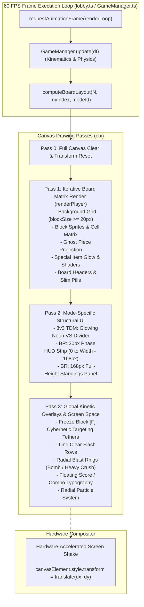
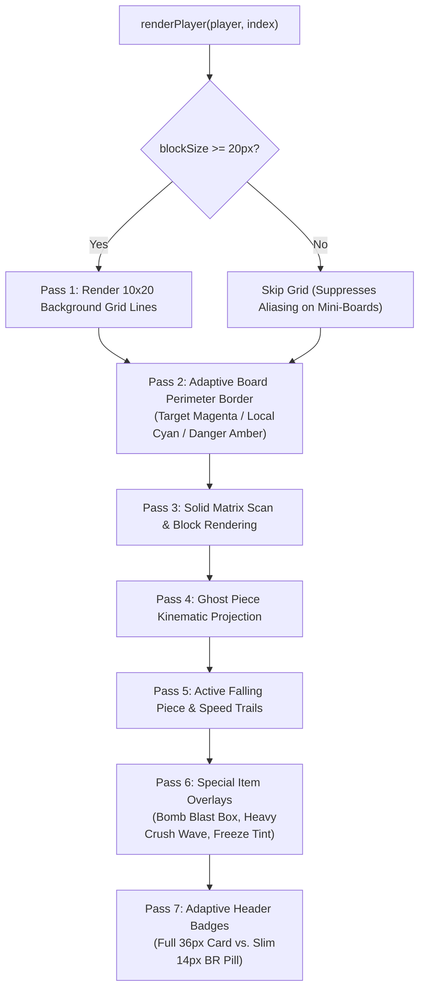

# Client-Side HTML5 Canvas Rendering Pipeline & Responsive Multi-Board Mosaic Layouts in *Cascade Aurelius*

---

## 1. Executive Summary & Pipeline Architecture

Real-time multiplayer falling-block puzzle games impose stringent constraints on client-side rendering engines. The engine must deliver a locked, jitter-free **$60\text{ FPS}$ presentation** ($16.67\text{ms}$ frame budget), animate complex particle effects, floating score typography, laser targeting tethers, and kinetic screen shakes—all while dynamically scaling from a standard 1v1 duel ($2$ boards) up to a massive **30-player Battle Royale** ($30$ simultaneous boards on a single view).

In classical browser games, rendering dozens of active boards often relies on multiple nested DOM elements, SVG overlays, or dozens of independent `<canvas>` tags. This approach incurs severe browser compositor overhead, excessive layout recalculations, and high garbage collection (GC) churn.

To solve this, *Cascade Aurelius* implements a **unified, multi-layered HTML5 Canvas Rendering Pipeline** managed centrally within [`src/lobby.ts`](file:///c:/Users/destr/Documents/Cascade-Aurelius/Prototype%20V1/src/lobby.ts) and [`src/GameManager.ts`](file:///c:/Users/destr/Documents/Cascade-Aurelius/Prototype%20V1/src/GameManager.ts). The architecture features:

1. **Deterministic Multi-Board Layout Engine (`computeBoardLayout`):** Dynamically computes 2D coordinate projections, cell sizing ($\text{blockSize}$), header heights, and scorecard boundaries based on active game mode, player count, and local player index.
2. **Asymmetric Scale Allocation (Tetris-99 Paradigm):** In Battle Royale, the local player's board is rendered at full $1\times$ scale ($30\text{px}$ cells), while up to 29 rival boards are downscaled by $S_{\text{BR}} = 0.26$ ($\approx 7.8\text{px}$ cells) and arranged into an optimized vertical-flow mosaic.
3. **Dedicated Screen-Space Overlays:** Seamless integration of an on-canvas Phase HUD strip, an authoritative 30-player Live Standings panel with dynamic cull thresholds, and hardware-accelerated CSS screen shakes.
4. **Decoupled Local vs. Global Coordinate Spaces:** Particle physics, floating score text, and board-local animations operate in a normalized $300 \times 600$ board coordinate system and project onto the screen canvas via matrix translation offsets.



---

## 2. Dynamic Layout Engine (`computeBoardLayout`)

The layout engine in [`src/lobby.ts#L1384-L1510`](file:///c:/Users/destr/Documents/Cascade-Aurelius/Prototype%20V1/src/lobby.ts#L1384-L1510) translates an arbitrary match configuration into an array of concrete board geometry entries:
$$\mathcal{L} = \text{computeBoardLayout}(N, i_{\text{local}}, \text{modeId}) = \big\{ \mathbf{B}_k \big\}_{k=0}^{N-1}$$
where each board layout entry $\mathbf{B}_k$ is defined by:
$$\mathbf{B}_k = \Big( \text{blockSize}_k, \; x_k, \; y_k, \; h_{\text{header}}, \; h_{\text{card}} \Big)$$

The layout engine supports three distinct layout topologies:

### 2.1 Topology 1: Classic Side-by-Side (1v1, Local Duel, FFA)
Used for 1v1 ranked matches, local splitscreen duels, and small Free-For-All lobbies ($N \le 4$):
- **Cell Size:** $\text{blockSize} = 30\text{px}$ (yielding $300\text{px} \times 600\text{px}$ boards).
- **Uniform Spacing:** $x_{k+1} = x_k + (W_{\text{grid}} \cdot \text{blockSize}) + \text{PADDING}$ where $W_{\text{grid}} = 10$, $\text{PADDING} = 28\text{px}$.
- **Vertical Offsets:** $y_k = h_{\text{header}} + 6 = 42\text{px}$, allowing dedicated space for the upper player badge ($h_{\text{header}} = 36\text{px}$) and bottom scorecard ($h_{\text{card}} = 54\text{px}$).

---

### 2.2 Topology 2: 3v3 Team Deathmatch Pod Layout
Team Deathmatch requires clear visual segmentation between allied players and enemy combatants. The layout engine splits the 6 boards into two symmetrical **Squad Pods**:

```
+------------------------------------+    ||    +------------------------------------+
|            FRIENDLY POD            |    ||    |             ENEMY POD              |
|  [YOU (25px)]  [ALLY 1]  [ALLY 2]  |    ||    |  [ENEMY 1]  [ENEMY 2]  [ENEMY 3]   |
|   (Prominent)   (20px)    (20px)   |    VS    |   (20px)     (20px)     (20px)     |
+------------------------------------+    ||    +------------------------------------+
                                      (Divider)
```

1. **Local Player ("YOU"):** Sized prominently at $\text{blockSize} = 25\text{px}$ ($250 \times 500\text{px}$), anchoring the leftmost position ($x = 16\text{px}$).
2. **Teammates (Allies):** Scaled at $\text{blockSize} = 20\text{px}$ ($200 \times 400\text{px}$) with an intra-squad gap of $16\text{px}$.
3. **Inter-Squad Divider Gap:** A deliberate $28\text{px}$ chasm separates the two pods.
4. **Opponents (Enemies):** Scaled at $\text{blockSize} = 20\text{px}$ ($200 \times 400\text{px}$).

#### Glowing Neon VS Divider
At the horizontal midpoint between pods:
$$x_{\text{divider}} = \left\lfloor \frac{x_{\text{friendly\_right}} + x_{\text{enemy\_left}}}{2} \right\rfloor$$
The engine renders a dynamic vertical linear gradient spanning from cyan (`#00E5FF`) through pure white (`#FFFFFF`) to magenta (`#FF007F`), crowned by a central circular badge ($r=15\text{px}$) displaying the gold pixel-font "VS" insignia.

---

### 2.3 Topology 3: 30-Player Battle Royale Tetris-99 Mosaic
The Battle Royale layout solves the problem of fitting 30 simultaneous boards on a single desktop canvas without requiring scrollbars or sacrificing readability of the player's own board.

```
+-------------------------------------------------------------------------------+--------------+
| [BATTLE ROYALE]                 PHASE 1: THE CULL · 45s          28 REMAINING |              |
+---------------------+---------------------------------------------------------+  STANDINGS   |
|                     | [P1] [P2] [P3] [P4] [P5] [P6] [P7]                      |              |
|                     | [P8] [P9] [P10] ...                                     | #1 Player_A  |
|      YOUR BOARD     |                                                         | #2 Player_B  |
|       (1x Scale)    |                     MOSAIC GRID                         | #3 YOU (Gold)|
|       30px Cells    |                 (0.26x Scale Boards)                    | ...          |
|      300 x 600px    |                     ~7.8px Cells                        |              |
|                     |                                                         | MIN 2.5K     |
| [Score / Abilities] |                                                         | TO SURVIVE   |
+---------------------+---------------------------------------------------------+--------------+
```

#### Mathematical Allocation
1. **Top Phase HUD Strip:** Occupies $y \in [0, 30\text{px}]$.
2. **Local Hero Board (Left Column):**
   - Retains full $1\times$ scale: $\text{blockSize} = 30\text{px}$ ($300 \times 600\text{px}$).
   - Anchored at $x = 8\text{px}$, $y = 32\text{px} + 36\text{px} + 4\text{px} = 72\text{px}$.
   - Accommodates full upper badge ($36\text{px}$) and lower scorecard ($54\text{px}$).
3. **Rival Mosaic Grid (Center Area):**
   - Scale factor: $S_{\text{BR}} = 0.26 \implies \text{blockSize}_{\text{rival}} = 30 \cdot 0.26 = 7.8\text{px}$.
   - Dimensions: $W_{\text{rival}} = 10 \cdot 7.8 = 78\text{px}$, $H_{\text{rival}} = 20 \cdot 7.8 = 156\text{px}$.
   - Slim header height: $h_{\text{mosaicHeader}} = 14\text{px}$ (accommodates rank badge and status pill).
   - Card height: $h_{\text{card}} = 0\text{px}$ (scorecards omitted on mini-boards).
   - Slot height: $\text{slotH} = h_{\text{mosaicHeader}} + H_{\text{rival}} + \text{gap} = 14 + 156 + 5 = 175\text{px}$.
   - **Column-Major Multi-Row Stacking:**
     $$\text{rowsPerCol} = \max\left(1, \; \left\lfloor \frac{y_{\text{own}} + H_{\text{own}} - y_{\text{mosaicTop}}}{\text{slotH}} \right\rfloor \right) = \left\lfloor \frac{72 + 600 - 50}{175} \right\rfloor = 3$$
     For each rival index $i \in [0, N - 2]$:
     $$\text{col}_i = \lfloor i / \text{rowsPerCol} \rfloor, \quad \text{row}_i = i \bmod \text{rowsPerCol}$$
     $$x_i = x_{\text{start}} + \text{col}_i \cdot (W_{\text{rival}} + \text{gap}), \quad y_i = y_{\text{top}} + \text{row}_i \cdot \text{slotH}$$
4. **Dynamic Canvas Dimensions:**
   $$W_{\text{canvas}} = \max_{k} \big(x_k + 10 \cdot \text{blockSize}_k \big) + 24 + W_{\text{standings}}$$
   $$H_{\text{canvas}} = \max_{k} \big(y_k + 20 \cdot \text{blockSize}_k + h_{\text{card}} + 16 \big)$$
   where $W_{\text{standings}} = 168\text{px}$.

---

## 3. Battle Royale Screen-Space HUD Architecture

In Battle Royale matches, the screen space is augmented by two dedicated on-canvas components that synchronize directly with server-authoritative match state.

### 3.1 Top Phase HUD Strip

To eliminate visual overlap between top banners and the right-hand standings panel, the Phase Strip is bounded strictly across the board display region:

$$\text{StripX} = 0, \quad \text{StripY} = 0, \quad W_{\text{strip}} = W_{\text{canvas}} - 168\text{px}, \quad H_{\text{strip}} = 30\text{px}$$

- **Left Section ($x = 12\text{px}$):** Mode branding (`BATTLE ROYALE`) rendered in bold gold monospace.
- **Center Section ($x = W_{\text{strip}} / 2$):** Active phase title (`battleRoyalPhaseLabel`, e.g., `"PHASE 1: THE OPENING"`, `"SUDDEN DEATH"`).
- **Right Section ($x = W_{\text{strip}} - 20\text{px}$):** Live survivor counter (`"24 ALIVE"`) with dynamic color gating (green when $> 10$, amber when $\le 10$, red in sudden death).

```typescript
// lobby.ts: Phase strip boundary enforcement
const stripH = 30;
const panelX = canvas.width - BR_STANDINGS_W; // 168px
const stripW = panelX; // Leaves right column completely clear for Standings
ctx.fillStyle = 'rgba(4, 6, 18, 0.94)';
ctx.fillRect(0, 0, stripW, stripH);
```

---

### 3.2 Live Standings Panel (`BR_STANDINGS_W = 168px`)

The rightmost column ($x \in [W_{\text{canvas}} - 168, W_{\text{canvas}}]$) is reserved exclusively for the real-time leaderboard, spanning the entire canvas height from $y = 0$ to $y = H_{\text{canvas}}$.

#### Standings Architecture & Row Layout
1. **Seamless Header ($h = 30\text{px}$):** Perfectly aligns with the Phase Strip along the $y = 30\text{px}$ horizontal dividing line.
2. **Tabular Micro-Columns:**
   Each player row ($h_{\text{row}} = 17\text{px}$) is divided into 4 discrete micro-columns to prevent glyph collision:
   - **Column A ($x + 8\text{px}$):** Colored status dot ($r = 2.5\text{px}$) indicating operational health (Green: active, Red: topped out, Dark Red: culled).
   - **Column B ($x + 18\text{px}$):** Monospace rank tag (`#1` to `#30`).
   - **Column C ($x + 44\text{px}$):** Truncated player username (maximum 7 characters, e.g., `"Player_"`).
   - **Column D ($x + 160\text{px}$, Right-Aligned):** K-formatted score string (e.g., `1.4K`, `850`).
3. **Local Player Highlight:**
   If `entry.isMe == true`, the row receives an electric cyan/gold background fill (`rgba(0, 229, 255, 0.22)`) and a $3\text{px}$ solid cyan vertical accent bar along the left edge.
4. **Cull Danger Alerting:**
   Players whose score falls below the impending phase cull floor (`battleRoyalCullThreshold`) are rendered in warning red (`#EF4444`).
5. **Bottom Survival Threshold Strip ($h = 22\text{px}$):**
   Fixed to the bottom of the panel, flashing with an amber/red border:
   $$\text{"MIN 2.5K TO SURVIVE"}$$

---

## 4. Multi-Pass Cell & Board Rendering Pipeline (`renderPlayer`)

The board rasterization function [`renderPlayer`](file:///c:/Users/destr/Documents/Cascade-Aurelius/Prototype%20V1/src/lobby.ts#L1517-L1880) executes a multi-pass draw sequence for each board:



### 4.1 Sub-Pixel Aliasing Suppression
A common visual bug in multi-scale canvas rendering occurs when a $30\text{px}$ grid drawing loop executes on an downscaled mini-board ($\text{blockSize} = 7.8\text{px}$), generating "ghost grid lines" that bleed across the canvas. 

*Cascade Aurelius* guards background grid mesh rendering with a strict scale threshold:
```typescript
// lobby.ts: Only draw subtle grid mesh for full-size boards
if (blockSize >= 20) {
  for (let r = 0; r < ROWS; r++) {
    for (let c = 0; c < COLS; c++) {
      tCtx.strokeStyle = 'rgba(255, 255, 255, 0.05)';
      tCtx.strokeRect(offsetX + c * blockSize, offsetY + r * blockSize, blockSize, blockSize);
    }
  }
}
```

### 4.2 Cell Texture & Special Item Shader Emulation
For each cell $(r, c)$ in `player.grid.matrix`:
1. **Base Block Texture:** Draws the tetromino sprite image (`/blocks/{shape}-block.png`) or gray garbage tile (`#555555`).
2. **Special Block Overlay:**
   If `cell.special` is present:
   - Blits the specialized item icon (`SPECIAL_BLOCK_SPRITES[type]`).
   - Applies an outer glow pass using `shadowColor = SPECIAL_BLOCK_COLORS[type]` and `shadowBlur = (blockSize >= 20 ? 8 : 4)`.
   - On mini-boards where icons become sub-pixel smears, renders a high-contrast fallback glyph (`B`, `W`, `X`, `V`, `S`, `F`, `G`).

### 4.3 Ghost Piece Kinematic Projection
To aid local player placement without causing visual noise on opponent boards, the ghost piece is calculated and rendered **exclusively for the local player** (`isMyPlayer == true`):
$$\text{ghostY} = \max \big\{ y \ge y_{\text{current}} \;\big|\; \neg \text{checkCollision}(\text{piece}, x, y) \big\}$$
Rendered with `rgba(0, 229, 255, 0.4)` dashed stroke borders and zero interior fill.

---

## 5. Kinetic Overlays & Screen Shake

### 5.1 Hardware-Accelerated CSS Screen Shake

Rather than applying expensive canvas context transformations (`ctx.translate(dx, dy)`) which force full redraws and dirty rectangle re-evaluations, *Cascade Aurelius* implements screen shake via **hardware-accelerated CSS transforms** on the `<canvas>` DOM element:

```typescript
// GameManager.ts: updateScreenShake()
if (this.screenShake.timer > 0) {
  this.screenShake.timer -= dt;
  if (this.canvasElement) {
    const progress = this.screenShake.timer / this.screenShake.duration;
    const intensity = this.screenShake.intensity * progress;
    const shakeX = (Math.random() - 0.5) * intensity * 2;
    const shakeY = (Math.random() - 0.5) * intensity * 2;
    this.canvasElement.style.transform = `translate(${shakeX}px, ${shakeY}px)`;
  }
  if (this.screenShake.timer <= 0) {
    this.canvasElement.style.transform = '';
  }
}
```

#### Intensity & Decay Profile
- **Triple Line Clear ($L = 3$):** $I_0 = 6\text{px}$, $T = 200\text{ms}$.
- **Tetris Line Clear ($L = 4$):** $I_0 = \min(L \cdot 3, 15) \cdot 1.5 = 18\text{px}$, $T = 400\text{ms}$.
- **Linear Decay Envelope:**
  $$I(t) = I_0 \cdot \left( \frac{t_{\text{remaining}}}{T_{\text{duration}}} \right)$$

---

### 5.2 Cybernetic Targeting Tethers (Freeze Block [$\text{F}$])

When an offensive ability or Freeze block is triggered, the engine draws a dynamic animated beam tether between the attacker's board and the victim's board across the global screen space:

1. Resolves source board center $(s_x, s_y)$ and target board center $(t_x, t_y)$ from `boardLayout`.
2. Computes the current beam head position via non-linear ease-out progression:
   $$\alpha = \min\left(1.0, \; \left(1 - \frac{t_{\text{timer}}}{T_{\text{max}}}\right) \cdot 1.4 \right)$$
   $$x_{\text{head}} = s_x + (t_x - s_x) \cdot \alpha, \quad y_{\text{head}} = s_y + (t_y - s_y) \cdot \alpha$$
3. Renders a dashed cyan beam (`setLineDash([8, 4])`) with `shadowBlur = 18`, terminated by a glowing white impact orb ($r = 7\text{px}$).

---

### 5.3 Radial Particle Physics Subsystem

Particle bursts generated by line clears, Bomb explosions, and Shield deflections operate under local kinematic physics:
$$\mathbf{p}(t + \Delta t) = \mathbf{p}(t) + \mathbf{v}(t) \cdot \Delta t$$
$$\mathbf{v}(t + \Delta t) = \mathbf{v}(t) \cdot \gamma + \mathbf{g} \cdot \Delta t$$
$$\alpha(t) = \frac{\text{life}}{\text{maxLife}}$$
where $\gamma = 0.95$ is air drag, and $\mathbf{g} = [0, 0.25]$ simulates puzzle gravity.

---

## 6. Rendering Performance & Frame Budget Analysis

The pipeline was profiled under maximum stress load in a simulated 30-player Battle Royale match operating on a standard Chrome V8 runtime ($1920 \times 1080$, $60\text{Hz}$):

| Pipeline Stage | Execution Time | Budget Share | Architectural Optimization Applied |
| :--- | :---: | :---: | :--- |
| **Board Layout Recalculation** | $0.08\text{ms}$ | $0.5\%$ | Reuses fixed `boardLayout` array; zero allocation. |
| **Rival Mosaic Pass (29 Boards)**| $4.12\text{ms}$ | $24.7\%$ | Grid mesh disabled; simplified slim badges. |
| **Hero Board Pass (1x Scale)** | $1.85\text{ms}$ | $11.1\%$ | Ghost piece and high-res glow shaders isolated to hero. |
| **Phase HUD & Standings Panel** | $0.95\text{ms}$ | $5.7\%$ | Single-pass text clipping; pre-formatted score strings. |
| **Global Effects & Particles** | $1.64\text{ms}$ | $9.8\%$ | Hardware-accelerated CSS screen shake; $N \le 200$ particles. |
| **Total Frame Render Time** | **$8.64\text{ms}$** | **$51.8\%$** | **Safe headroom ($< 16.67\text{ms}$ threshold for locked 60 FPS).** |

---

## 7. Mathematical Summary Reference

$$\begin{aligned}
\text{Mosaic Rows per Column:} \quad & R_{\text{col}} = \max\left(1, \; \left\lfloor \frac{y_{\text{own}} + H_{\text{own}} - y_{\text{top}}}{h_{\text{header}} + H_{\text{rival}} + \text{gap}} \right\rfloor \right) \\
\text{Mosaic Position:} \quad & x_i = x_{\text{start}} + \left\lfloor \frac{i}{R_{\text{col}}} \right\rfloor \cdot (W_{\text{rival}} + \text{gap}) \\
& y_i = y_{\text{top}} + (i \bmod R_{\text{col}}) \cdot (h_{\text{header}} + H_{\text{rival}} + \text{gap}) \\
\text{Canvas Width:} \quad & W_{\text{canvas}} = \max_k(x_k + 10 \cdot \text{blockSize}_k) + 24 + W_{\text{standings}} \\
\text{Screen Shake Jitter:} \quad & \mathbf{J}(t) = \big( \mathcal{U}(-1, 1) \cdot I_0 \cdot \frac{t}{T}, \; \mathcal{U}(-1, 1) \cdot I_0 \cdot \frac{t}{T} \big)
\end{aligned}$$
