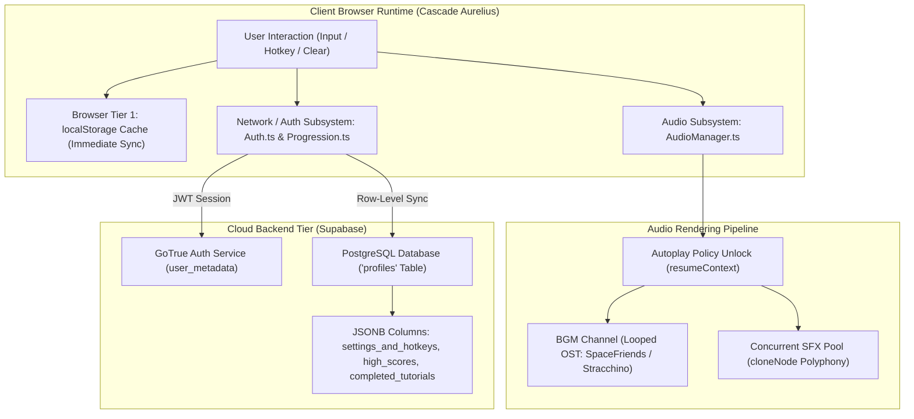
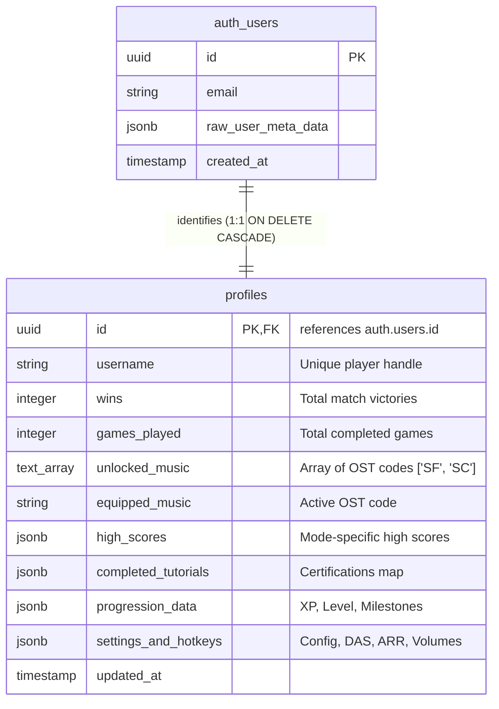

# Database Architecture, Cloud Persistence, and Dynamic Audio Subsystem in *Cascade Aurelius*

---

## 1. Executive Summary & Infrastructure Overview

High-fidelity competitive action games require robust backend data persistence and low-latency reactive audio systems. In *Cascade Aurelius*, these two foundational subsystems operate synergistically:

1. **Database & Cloud Persistence:** Powered by **Supabase Backend Services** (PostgreSQL, Row-Level Security, and GoTrue Auth), the persistence tier implements an **offline-first dual-layer storage model**. Game data—including high scores, player experience, cosmetics, hotkeys, and tutorial certifications—is serialized synchronously to browser `localStorage` for zero-latency frame-0 hydration, and asynchronously replicated to relational PostgreSQL tables and user authentication metadata with additive JSONB merging.
2. **Dynamic Audio Architecture:** Managed via a centralized singleton engine in [`src/AudioManager.ts`](file:///c:/Users/destr/Documents/Cascade-Aurelius/Prototype%20V1/src/AudioManager.ts), the audio subsystem navigates browser autoplay restrictions, manages an in-game unlockable Original Soundtrack (OST) catalog with seamless background looping, and supports **zero-latency concurrent SFX playback** using dynamic DOM audio node cloning (`HTMLAudioElement.cloneNode()`).



---

## 2. Database Architecture & Cloud Persistence

The persistence architecture in *Cascade Aurelius* addresses a critical challenge in web-based esports: **instantaneous local load times combined with tamper-resistant cloud synchronization**.

### 2.1 Entity-Relationship & Relational Schema Design

The backend database is structured around a central PostgreSQL relational table [`profiles`](file:///c:/Users/destr/Documents/Cascade-Aurelius/Prototype%20V1/src/Auth.ts), bound $1:1$ to Supabase's internal `auth.users` authentication table:



#### SQL Schema Definition
```sql
CREATE TABLE public.profiles (
    id UUID PRIMARY KEY REFERENCES auth.users(id) ON DELETE CASCADE,
    username TEXT UNIQUE NOT NULL,
    wins INTEGER DEFAULT 0 NOT NULL,
    games_played INTEGER DEFAULT 0 NOT NULL,
    unlocked_music TEXT[] DEFAULT ARRAY['SF']::TEXT[] NOT NULL,
    equipped_music TEXT DEFAULT 'SF' NOT NULL,
    high_scores JSONB DEFAULT '{}'::JSONB NOT NULL,
    completed_tutorials JSONB DEFAULT '{}'::JSONB NOT NULL,
    progression_data JSONB DEFAULT '{"level": 1, "xp": 0, "points": 0}'::JSONB NOT NULL,
    settings_and_hotkeys JSONB DEFAULT '{}'::JSONB NOT NULL,
    updated_at TIMESTAMP WITH TIME ZONE DEFAULT timezone('utc'::text, now()) NOT NULL
);

-- Row-Level Security (RLS) Policies
ALTER TABLE public.profiles ENABLE ROW LEVEL SECURITY;

CREATE POLICY "Public profiles are viewable by everyone" 
ON public.profiles FOR SELECT USING (true);

CREATE POLICY "Users can insert their own profile" 
ON public.profiles FOR INSERT WITH CHECK (auth.uid() = id);

CREATE POLICY "Users can update their own profile" 
ON public.profiles FOR UPDATE USING (auth.uid() = id);
```

---

### 2.2 Dual-Tier Persistence & Offline-First Hydration

To prevent blocking network calls during game startup, *Cascade Aurelius* implements an **Additive Dual-Tier Storage Pipeline** across [`src/HighScores.ts`](file:///c:/Users/destr/Documents/Cascade-Aurelius/Prototype%20V1/src/HighScores.ts), [`src/Settings.ts`](file:///c:/Users/destr/Documents/Cascade-Aurelius/Prototype%20V1/src/Settings.ts), and [`src/TutorialManager.ts`](file:///c:/Users/destr/Documents/Cascade-Aurelius/Prototype%20V1/src/TutorialManager.ts).

```
[Local Keystroke / Match End]
             │
             ├──► [Tier 1: Synchronous Local Write] ──► localStorage (Zero Latency)
             │
             └──► [Tier 2: Asynchronous Cloud Sync] ──► Supabase API
                                                               │
                                  ┌────────────────────────────┴───────────────────────────┐
                                  ▼                                                         ▼
                     auth.updateUser()                                         profiles.update()
              (Serializes into JWT metadata)                       (Additive JSONB merge on Postgres)
```

#### The Additive JSONB Merge Strategy
To prevent overwriting configuration keys when different subsystems update the database concurrently, the client performs an atomic additive shallow merge on the PostgreSQL JSONB record:

```typescript
// Settings.ts: Additive cloud synchronization
if (currentUserId) {
  const { data: existingRow } = await supabase
    .from('profiles')
    .select('settings_and_hotkeys')
    .eq('id', currentUserId)
    .single();

  const mergedJsonb = {
    ...(existingRow?.settings_and_hotkeys || {}),
    ...newSettingsPayload,
    completedTutorials: localTutorialMap,
    highScores: localHighScoreMap,
  };

  await supabase.from('profiles').update({
    settings_and_hotkeys: mergedJsonb,
  }).eq('id', currentUserId);
}
```

#### Additive Union Hydration
Upon user sign-in, the client pulls cloud data and performs an additive mathematical union with existing local storage:
$$\mathcal{D}_{\text{client}} \leftarrow \mathcal{D}_{\text{localStorage}} \cup \mathcal{D}_{\text{auth\_meta}} \cup \mathcal{D}_{\text{profiles\_db}}$$
This guarantees that matches played as an unauthenticated guest or while offline are safely merged into the user's permanent profile rather than discarded.

---

### 2.3 Authentication Lifecycle & Session Telemetry

Implemented in [`src/Auth.ts`](file:///c:/Users/destr/Documents/Cascade-Aurelius/Prototype%20V1/src/Auth.ts), authentication utilizes GoTrue token-based sessions:
1. **Registration & Auto-Confirmation:** Supports both instant email registration and confirmed email workflows via `supabase.auth.signUp()`.
2. **Session Monitoring:** The runtime subscribes to `supabase.auth.onAuthStateChange((_event, session) => ...)`:
   - When authenticated, the UI hides guest CTA buttons and mounts the user badge displaying `user_metadata.username`.
   - Fires background hydration across `HighScores`, `Settings`, `Progression`, and `TutorialManager`.
   - On `SIGNED_OUT`, gracefully drops back to guest `localStorage` state without crashing active gameplay.

### 2.4 Competitive Leaderboards & Match Telemetry

In [`src/Statistics.ts`](file:///c:/Users/destr/Documents/Cascade-Aurelius/Prototype%20V1/src/Statistics.ts), global player telemetry is aggregated through optimized PostgreSQL queries:
```typescript
// Statistics.ts: Global Leaderboard Retrieval
const { data, error } = await supabase
  .from('profiles')
  .select('id, username, wins, games_played')
  .order('wins', { ascending: false })
  .limit(50);
```

Player win rates are calculated authoritatively:
$$\text{WinRate} = \left( \frac{\text{wins}}{\max(1, \; \text{games\_played})} \right) \times 100\%$$

---

## 3. Dynamic Audio Architecture (`AudioManager.ts`)

Falling-block puzzle games require precise acoustic cues: players rely on audio feedback to verify piece locking, rotation kicks, T-spins, ability triggers, and incoming garbage threats without averting their visual focus from the matrix.

Implemented as a centralized singleton in [`src/AudioManager.ts`](file:///c:/Users/destr/Documents/Cascade-Aurelius/Prototype%20V1/src/AudioManager.ts), the audio engine manages background music (BGM) and one-shot sound effects (SFX).

### 3.1 Web Audio Autoplay Policy & Context Resumption

Modern web browsers enforce strict autoplay policies, blocking programmatic audio playback until the user interacts with the DOM.

#### Context Unlocking Mechanism
To guarantee seamless audio without dropped triggers, `AudioManager.resumeContext()` is wired to the user's first input event (click or keypress):

```typescript
// AudioManager.ts: resumeContext()
resumeContext() {
  if (typeof Audio === 'undefined' || unlocked) return;
  unlocked = true;

  // Play + immediately pause a silent buffer to unlock the audio context
  // across all browser engines (WebKit, Blink, Gecko).
  const silent = new Audio();
  silent.play().catch(() => {/* expected to fail silently */});

  // If music was requested prior to user gesture, start it immediately
  if (currentTrack && currentMusic) {
    currentMusic.play().catch(() => {});
  }
}
```

---

### 3.2 Dynamic Music Catalog & Looping Engine

The game soundtrack is divided into menu themes and an **unlockable in-game OST catalog** keyed by compact two-character song codes:

```typescript
// AudioManager.ts: OST Catalog Definition
export const OST_TRACKS: Record<string, OstTrackDef> = {
  SF: {
    code: 'SF',
    name: 'SpaceFriends',
    src: '/audio/ost/SpaceFriends.m4a',
    cost: 0,
    description: 'Default cosmic synthwave soundtrack (SF). Included for all players.',
    accent: '#00e5ff',
  },
  SC: {
    code: 'SC',
    name: 'Stracchino',
    src: '/audio/ost/Stracchino.wav',
    cost: 250,
    description: 'High-tempo arcade soundtrack (SC). Unlockable with match points.',
    accent: '#ffd700',
  },
};
```

#### Track Selection Pipeline
When entering a match (`AudioManager.playMusic('game')`):
1. The engine calls `getAllowedGameMusicSources()`, querying `localStorage` and Supabase profile progression data.
2. If the user has equipped a specific track (e.g., `'SC'`), that track source is selected exclusively.
3. If no track is equipped, the engine randomly samples uniformly from all unlocked tracks:
   $$\text{src} \sim \mathcal{U}\big(\{ \text{src}_k \mid \text{track}_k \in \text{UnlockedMusic} \}\big)$$
4. Configures looping (`audio.loop = true`), applies the user's attenuation multiplier (`audio.volume = musicVolume`), and smoothly starts playback.

---

### 3.3 Concurrent Polyphonic SFX Engine (`cloneNode`)

A critical challenge in fast puzzle games (where players reach speeds of $2\text{–}4\text{ PPS}$ [Pieces Per Second]) is **audio clipping**. If a single `HTMLAudioElement` instance is replayed while its previous playback is underway, the browser cuts off the sound, creating jagged, unpleasant clicks.

*Cascade Aurelius* solves this through **Dynamic Polyphonic DOM Cloning**:

```typescript
// AudioManager.ts: playSfx()
playSfx(name: SfxClip) {
  if (typeof Audio === 'undefined' || !unlocked) return;
  const src = SFX_CLIPS[name];
  const base = getOrCreate(src);
  if (!base || typeof base.cloneNode !== 'function') return;

  // Clone node allows rapid-fire audio (e.g., consecutive line clears)
  // to overlap naturally without truncating active waveforms
  const clone = base.cloneNode() as HTMLAudioElement;
  clone.volume = sfxVolume;
  clone.play().catch(() => {});
}
```

```
Trigger 1 (t = 0ms)    [=========== Line Clear Waveform ===========]
Trigger 2 (t = 120ms)         [=========== Line Clear Waveform ===========]  <-- Overlaps cleanly via cloneNode
Trigger 3 (t = 240ms)                [=========== Line Clear Waveform ===========]
```

#### Sound Effects (SFX) Taxonomy

| SFX Identifier | Asset Path | Acoustic Description & Gameplay Trigger |
| :--- | :--- | :--- |
| `'menuSelect'` | `/audio/sfx/sfx-Select.wav` | Crisp tactile click for button navigation and modal selection. |
| `'lineClear'` | `/audio/sfx/sfx-LineClear.wav` | Bright harmonic chime for standard line clears (Single, Double, Triple, Tetris). |
| `'bomb'` | `/audio/sfx/sfx-Bomb.mp3` | Low-frequency explosive detonation for Bomb Block [$\text{B}$] $3 \times 3$ clearing. |
| `'heavy'` | `/audio/sfx/sfx-Heavy.mp3` | Deep metallic kinetic crunch for Heavy Block [$\text{W}$] underline crushing. |
| `'multiplier'`| `/audio/sfx/sfx-Multiplier.mp3` | Ascending cybernetic pulse indicating $2.0\times$ score amplification. |
| `'speed'` | `/audio/sfx/sfx-Speed.mp3` | High-frequency aerodynamic whoosh for Speed Block [$\text{V}$] time dilation. |
| `'shield'` | `/audio/sfx/sfx-Shield.mp3` | Resonant energy barrier chime for Shield Block [$\text{S}$] garbage deflection. |
| `'freeze'` | `/audio/sfx/sfx-Freeze.mp3` | Crystalline ice fracture for Freeze Block [$\text{F}$] ability lockout. |
| `'garbageEater'`| `/audio/sfx/sfx-GarbageEater.mp3`| Alchemical devouring synth for transmuting garbage into $+800\text{ PTS}$. |
| `'ultimate'` | `/audio/sfx/sfx-Ultimate.mp3` | Grand orchestral brass surge when unleashing Class Ultimates ($[\text{R}]$). |
| `'death'` | `/audio/sfx/sfx-Death.mp3` | Somber descending tone marking matrix top-out or tournament elimination. |

---

### 3.4 Pre-Instantiation & Memory Cache

To ensure zero latency during high-speed gameplay, `AudioManager` initiates an aggressive preloading sweep immediately upon script evaluation:

```typescript
// AudioManager.ts: Map-based audio asset cache
const audioCache = new Map<string, HTMLAudioElement>();

function getOrCreate(src: string): HTMLAudioElement {
  let audio = audioCache.get(src);
  if (!audio) {
    audio = new Audio(src);
    audio.preload = 'auto';
    audioCache.set(src, audio);
  }
  return audio;
}
```

Preloading assets into memory guarantees that audio buffers are fully decoded by the browser before the first block drops.

---

## 4. Architectural Synergies: Audio & Persistence Integration

The audio subsystem and cloud persistence layer deeply interconnect:

1. **Audio Settings Persistence:**
   When a player adjusts music or SFX volume sliders in the settings modal, `AudioManager.setMusicVolume(v)` updates the active audio channels immediately, while `Settings.ts` dispatches a debounced cloud write updating `profiles.settings_and_hotkeys.musicVolume`.
2. **Cosmetic Economy & Music Unlocking:**
   Matches award match points to `profiles.progression_data.points`. When a player purchases the *Stracchino* track ($250\text{ pts}$), the transaction updates `profiles.unlocked_music = ARRAY['SF', 'SC']`. `AudioManager` detects the updated array and dynamically introduces the newly purchased track into the game playlist rotation.

---

## 5. Comparative Architectural Analysis

| Dimension | Classical Browser Game Architecture | *Cascade Aurelius* Hybrid Subsystem Architecture |
| :--- | :--- | :--- |
| **Storage Model** | Pure `localStorage` or pure remote DB | Additive Dual-Tier (Synchronous `localStorage` + Asynchronous PostgreSQL JSONB) |
| **Auth Integration** | Isolated session cookie | Supabase GoTrue token JWT with synchronized `user_metadata` & RLS policies |
| **Audio Concurrency**| Single audio element (waveform clipping) | Dynamic `cloneNode()` DOM polyphony supporting overlapping rapid clears |
| **Autoplay Handling**| Unhandled errors causing silent games | Zero-volume buffer unlock pattern (`resumeContext`) bound to first user gesture |
| **Music Catalog** | Static hardcoded audio loops | Unlockable cosmetic catalog (`SF`, `SC`) bound to cloud progression economics |

---

## 6. Summary Equations & Mathematical Reference

$$\begin{aligned}
\text{Effective Volume:} \quad & V_{\text{out}} = V_{\text{master}} \cdot V_{\text{channel}} \quad (V \in [0.0, 1.0]) \\
\text{Win Rate Formula:} \quad & \text{WR} = \left( \frac{\text{wins}}{\max(1, \; \text{games\_played})} \right) \times 100\% \\
\text{Additive Storage Union:} \quad & \mathcal{S}_{\text{active}} = \mathcal{S}_{\text{local}} \cup \mathcal{S}_{\text{auth\_meta}} \cup \mathcal{S}_{\text{profiles\_db}} \\
\text{Music Random Selection:} \quad & P(\text{Track}_k) = \frac{1}{|\text{UnlockedMusic}|} \quad \forall k \in \text{UnlockedMusic}
\end{aligned}$$
