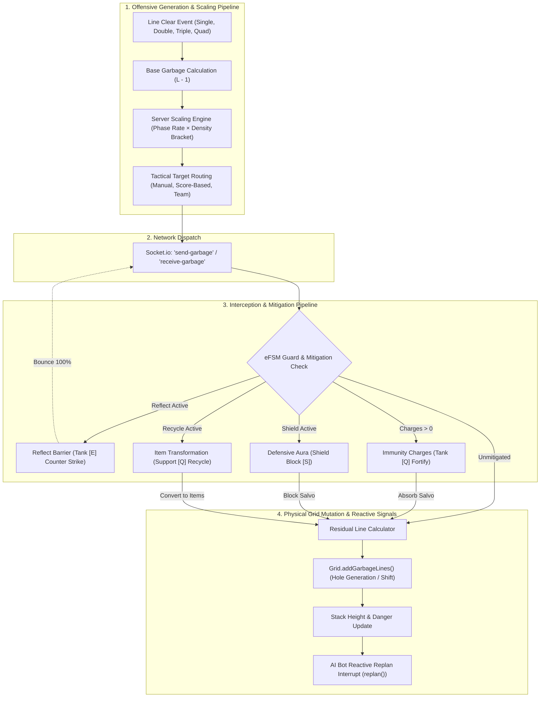
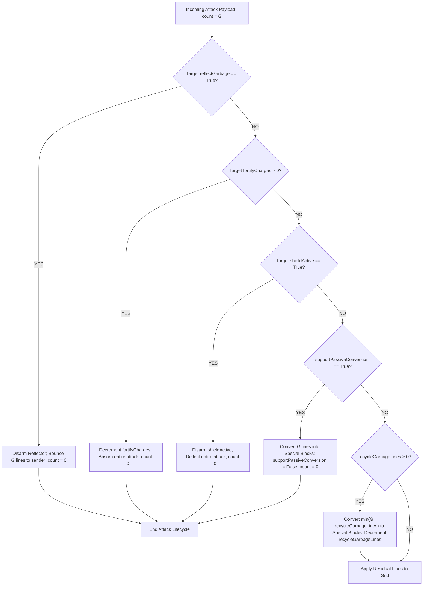
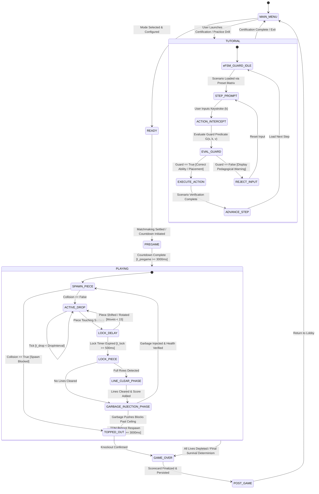

# Systems Architecture: Garbage Calculation Dynamics and Extended Finite State Machine (eFSM) Integration in *Cascade Aurelius*

---

## 1. Executive Summary & Theoretical Framework

Competitive falling-block puzzles rely fundamentally on **adversarial feedback loops** to create high-stakes tension between players. In *Cascade Aurelius*, this loop is mediated through two closely coupled subsystems:

1. **The Garbage Calculation & Mitigation Pipeline:** A multi-stage mathematical engine that transforms line-clearing events, class abilities, and environmental modifiers into scalar garbage attacks, routes them across network topologies, subjects them to defensive and transformative mitigation barriers (Shields, Fortify, Reflect, Recycle), and physically injects them into receiving grids.
2. **The Extended Finite State Machine (eFSM) Architecture:** A formal state-automaton model that expands classical Finite State Machines by augmenting discrete symbolic states with **continuous multi-dimensional context variables**, **boolean guard predicates**, and **event-driven side-effect actions**. 

While a classical FSM is limited to representing static game phases, the eFSM serves as both the **macro-level match orchestrator** (coordinating transitions between `MAIN_MENU`, `PREGAME`, `PLAYING`, `TUTORIAL`, and `GAME_OVER`) and a **strict input-verification guard** (ensuring pedagogical invariance during class certification drills and competitive integrity during active play).



---

## 2. Mathematical Formulation of Garbage Dynamics

### 2.1 Base Offensive Generation Function
Garbage production is fundamentally rooted in clearing simultaneous lines. In *Cascade Aurelius*, line clearing follows a non-linear stepped function designed to disincentivize single-line stalling while heavily rewarding complex 4-line Quads (*Tetrises*):

$$\mathcal{G}_{\text{base}}(L) = \begin{cases} 
0 & \text{if } L = 1 \quad (\text{Single}) \\
1 & \text{if } L = 2 \quad (\text{Double}) \\
2 & \text{if } L = 3 \quad (\text{Triple}) \\
4 & \text{if } L = 4 \quad (\text{Quad / Tetris}) \\
L & \text{if } L > 4 \quad (\text{Special Item Over-Clears})
\end{cases}$$

In the client implementation ([`src/GameManager.ts`](file:///c:/Users/destr/Documents/Cascade-Aurelius/Prototype%20V1/src/GameManager.ts#L1395-L1405)), this is executed as:
```typescript
if (linesCleared >= 2) {
  const garbageCount = linesCleared === 4 ? 4 : linesCleared - 1;
  if (this.isOnline && this.network && this.state !== GameState.TUTORIAL) {
    this.network.sendGarbage(garbageCount, player.selectedTargetIndex ?? undefined);
  } else {
    this.distributeGarbage(player, garbageCount);
  }
}
```

### 2.2 Server-Side Environmental Scaling (`Server/index.js`)
When playing in multiplayer environments—particularly Battle Royale—static garbage values lead to prolonged, unresolvable matches. The authoritative Node.js server subjects all incoming garbage requests to dynamic multipliers based on match progression and room density:

$$\mathcal{G}_{\text{scaled}} = \max\left(1, \; \left\lfloor \mathcal{G}_{\text{requested}} \times \mathcal{R}_{\text{active}}(\text{room}) + 0.5 \right\rfloor \right)$$

The environmental rate multiplier $\mathcal{R}_{\text{active}}$ is formulated as a product of three independent dynamic factors:
$$\mathcal{R}_{\text{active}}(\text{room}) = \rho_{\text{phase}}(t) \times \delta_{\text{dynamic}} \times (1 + \beta_{\text{density}})$$

Where:
1. **Phase Rate ($\rho_{\text{phase}}$):** Governed by the Battle Royale phase timer (`Server/battleRoyal.js`).
   - Phase 1 (*Garbage Surge*, $0\text{–}60\text{s}$): $\rho = 2.5$ (Intense opening pressure).
   - Phase 2 (*Item Frenzy*, $60\text{–}120\text{s}$): $\rho = 1.0$.
   - Phase 3 (*Score Frenzy*, $120\text{–}180\text{s}$): $\rho = 1.0$.
   - Phase 4 (*Pure Skill / Sudden Death*, $180\text{–}240\text{s}$): $\rho = 1.0$ with `solidGarbage: true`.
2. **Dynamic Server Rules ($\delta_{\text{dynamic}}$):** Room-wide modifier events (e.g., active server events multiplying output by $1.5$).
3. **Density Speed Bonus ($\beta_{\text{density}}$):** Scaled according to active player brackets:
   $$\beta_{\text{density}} = \begin{cases} 
   0.5 & \text{if } N_{\text{alive}} > 16 \\ 
   0.0 & \text{if } N_{\text{alive}} \le 16 
   \end{cases}$$

```javascript
// Authoritative Scaling Implementation in Server/index.js
function activeGarbageRate(room) {
  if (room.mode.id !== 'battle-royale' || !room.battleRoyalStartedAt) return 1;
  const phase = getBattleRoyalPhase(Date.now() - room.battleRoyalStartedAt);
  let rate = phase.garbageRate || 1;
  if (room.activeDynamicRule?.garbageRate) rate *= room.activeDynamicRule.garbageRate;
  const bracket = getDensityBracket(activePlayerCount(room));
  rate *= 1 + (bracket.garbageSpeedBonus || 0);
  return rate;
}
```

---

### 2.3 Active Ability Garbage Spikes & Inescapable Sudden Death

Beyond regular line clears, the garbage subsystem processes two specialized payloads:

#### 1. Tank Class Ultimate: Earthquake (`[R] Earthquake`)
Unlike line-clear attacks that route to a single target, the Tank's ultimate dispatches an authoritative multi-target salvo:
$$\forall p \in \text{Opponents}(\text{sender}), \quad \mathcal{G}_{\text{incoming}}(p) = 4$$
This sends 4 rows of sudden garbage simultaneously to every opposing board on the canvas.

#### 2. Solid Sudden-Death Garbage (`solidGarbage`)
In Phase 4 of Battle Royale, garbage lines cease to feature open holes. The server tags the payload with `solid: true` and `unClearable: true`:
$$\mathcal{M}_{\text{cell}} = \{ \text{type}: \text{'GARBAGE'}, \; \text{unClearable}: \text{True} \}$$
Because these rows possess no empty holes, standard row completion is impossible. Solid garbage lines cannot be cleared by regular line clears; they permanently shrink the playable height of the matrix, driving the match to a deterministic conclusion.

---

## 3. The Interception & Mitigation Pipeline

When an authoritative `receive-garbage` packet arrives at a client, it is not immediately applied to the grid. It passes through a sequential, prioritized **Mitigation Pipeline**:



### 3.1 Mitigation Operators

| Priority | Mechanism | Governing Class/Item | Operational Semantics | Residual Attack ($\mathcal{G}'$) |
| :---: | :--- | :--- | :--- | :--- |
| **1** | **Reflect Barrier** | *Tank* (`[E] Counter Strike`) | Deflects the incoming payload directly back to the original attacker. | $\mathcal{G}' = 0$; $\mathcal{G}_{\text{reflected}} = \mathcal{G}$ |
| **2** | **Fortify Immunity** | *Tank* (`[Q] Fortify`) | Consumes 1 of 2 charges; completely neutralizes attacks of arbitrary size (even $10$-line salvos). | $\mathcal{G}' = 0$ |
| **3** | **Shield Aura** | Special Block (`Shield [S]`) | Absorbs exactly one incoming attack salvo, dissipating the defensive barrier. | $\mathcal{G}' = 0$ |
| **4** | **Support Passive** | *Support* (Passive Quad) | Converts the entire incoming attack volume into Special Item Blocks. | $\mathcal{G}' = 0$ (Converted) |
| **5** | **Recycle Charges** | *Support* (`[Q] Recycle`) | Converts up to $k$ incoming lines into Special Blocks; remaining lines pass through. | $\mathcal{G}' = \max(0, \mathcal{G} - k)$ |
| **6** | **Unmitigated Injection** | Default State | Injects remaining rows as gray garbage into the bottom of the grid. | $\mathcal{G}' = \mathcal{G}$ |

### 3.2 Physical Grid Injection & Hole Consistency
When unmitigated lines $\mathcal{G}'$ penetrate the defensive pipeline, [`Grid.addGarbageLines()`](file:///c:/Users/destr/Documents/Cascade-Aurelius/Prototype%20V1/src/Grid.ts#L254-L296) executes physical insertion:

1. **Matrix Shift:** The existing grid contents are shifted vertically upwards by $\mathcal{G}'$ rows:
   $$\forall r \in [0, H - 1 - \mathcal{G}'], \quad \mathcal{M}_{r, c} \leftarrow \mathcal{M}_{r + \mathcal{G}', c}$$
2. **Top-Out Verification:** If any occupied block is shifted beyond row $r = 0$, the player enters a top-out failure state.
3. **Stochastic Hole Continuity:**
   To reward skilled players, garbage rows generated from a single attack salvo share an identical hole column index $c_{\text{hole}}$ with probability $p = 0.85$:
   $$c_{\text{hole}}^{(r)} = \begin{cases} 
   c_{\text{hole}}^{(r-1)} & \text{with probability } 0.85 \\ 
   \mathcal{U}\{0, W-1\} & \text{with probability } 0.15 
   \end{cases}$$
   This allows a skilled player to downstack through an attack with a single well-placed `I`-tetromino.

---

## 4. The Extended Finite State Machine (eFSM) Architecture

### 4.1 Theoretical Formalism of eFSM
A classical Finite State Machine is defined by the 6-tuple:
$$\mathcal{M}_{\text{classical}} = (S, S_0, \Sigma, \Lambda, \delta, \omega)$$
where $S$ is a finite set of states, $\Sigma$ is the input alphabet, and $\delta: S \times \Sigma \to S$ is the transition function. Classical FSMs suffer from **state explosion** when applied to complex game systems; tracking a 500ms lock delay timer, 2 fortify charges, a 50-point class meter, and 10 rows of garbage would require millions of distinct states.

The **Extended Finite State Machine (eFSM)** solves this by augmenting states with continuous and discrete context variables:
$$\mathcal{M}_{\text{eFSM}} = (S, S_0, \mathcal{V}, \Sigma, \Lambda, \mathcal{G}_{\text{pred}}, \mathcal{A}, \delta, \omega)$$

Where:
- $S$: Finite set of symbolic macro states.
- $\mathcal{V} = \{v_1, v_2, \dots, v_n\}$: Internal context evaluation vector (continuous timers, integer charges, float gravity, grid matrices).
- $\mathcal{G}_{\text{pred}}: S \times \Sigma \times \mathcal{V} \to \{\text{True}, \text{False}\}$: Set of **guard predicates** that must be satisfied to permit a transition.
- $\mathcal{A}: S \times \Sigma \times \mathcal{V} \to \mathcal{V}$: Set of data transformation actions executed upon transition.
- $\delta: S \times \Sigma \times \mathcal{G}_{\text{pred}} \to S$: The guarded state transition function.



---

## 5. System-Wide eFSM Topography & Concrete Variables

### 5.1 The eFSM Context Vector ($\mathcal{V}$)
In *Cascade Aurelius*, the eFSM context vector $\mathcal{V}$ is maintained across [`GameManager.ts`](file:///c:/Users/destr/Documents/Cascade-Aurelius/Prototype%20V1/src/GameManager.ts) and [`Player.ts`](file:///c:/Users/destr/Documents/Cascade-Aurelius/Prototype%20V1/src/Player.ts):

```typescript
// Formal eFSM Context Variable Set (V)
interface EfsmContextVector {
  // Continuous Timers
  dropInterval: number;          // Current gravity interval (ms)
  lockDelayTimer: number;        // Lock delay threshold (500ms)
  timeWarpTimer: number;         // Speedster slowdown duration (6000ms)
  bulletTimeTimer: number;       // Speedster global freeze duration (5000ms)
  chaosTimer: number;            // Saboteur reverse control duration (8000ms)
  abilityFreezeTimer: number;    // Freeze Special Block lockout (3000ms)
  garbageEaterTimer: number;     // Item digestion visual duration (950ms)
  
  // Integer Charge Counters
  fortifyCharges: number;        // Tank immunity charges (0, 1, 2)
  recycleGarbageLines: number;   // Support conversion queue (0-4)
  lockResetMoves: number;        // Maximum lock delay extension budget (0-15)
  classMeter: number;            // Energy towards ultimate ability (0-50)
  
  // Boolean State Flags
  reflectGarbage: boolean;       // Tank reflection barrier
  shieldActive: boolean;         // Shield aura block state
  supportPassiveConversion: boolean; // Automatic conversion on next incoming attack
  gridShiftUsed: boolean;        // Saboteur match-limited ability flag
  isSolidSuddenDeath: boolean;   // Battle Royale terminal state flag
}
```

### 5.2 Micro-Lifecycle: The Lock Delay Extended Automaton
A prime example of eFSM utility is the piece lock-delay mechanism. A pure FSM would instantly lock a piece upon touching a floor, creating an unplayable game. 

The eFSM implements the **Infinity Lock-Delay Rule**:
1. When piece reaches floor: $S \leftarrow \text{LOCK\_DELAY}$, $t_{\text{lock}} \leftarrow 0$.
2. While in $\text{LOCK\_DELAY}$:
   - If player translates or rotates:
     $$\text{Guard}: \text{moves} < 15 \land \text{CanMove} \implies t_{\text{lock}} \leftarrow 0, \; \text{moves} \leftarrow \text{moves} + 1$$
   - If $t_{\text{lock}} \ge 500\text{ ms}$ or $\text{moves} \ge 15$:
     $$\text{Guard}: t_{\text{lock}} \ge 500 \lor \text{moves} \ge 15 \implies \text{Transition}(\text{LOCK\_PIECE})$$

---

## 6. The eFSM Guard & Input Verification Engine (`TutorialManager.ts`)

In multiplayer games, tutorials are notoriously fragile: players fail to follow instructions, press incorrect buttons, top out, and become soft-locked. 

To guarantee deterministic certification, *Cascade Aurelius* implements an **eFSM Guard Engine** ([`src/TutorialManager.ts`](file:///c:/Users/destr/Documents/Cascade-Aurelius/Prototype%20V1/src/TutorialManager.ts#L1448-L1815)). Under `GameState.TUTORIAL`, the eFSM isolates the board from normal engine rules and acts as a strict **input firewall**.

```
    Keystroke Event (k)
           |
           v
    +--------------------------------------------------------+
    |           eFSM Guard Evaluator (TutorialManager)        |
    +--------------------------------------------------------+
    | Guard Condition:                                       |
    |   Is input k permitted in state (certStep, activeClass)|
    |   given current context V?                             |
    +--------------------------------------------------------+
             |                                      |
         [FALSE]                                 [TRUE]
             |                                      |
             v                                      v
    +------------------------+             +------------------------+
    | 1. Reject Keystroke    |             | 1. Execute Keystroke   |
    | 2. Intercept Default   |             | 2. Apply Side Effect A |
    | 3. Render Custom Banner|             | 3. Advance certStep    |
    |    "eFSM Guard Warning"|             | 4. Update UI HUD       |
    +------------------------+             +------------------------+
```

### 6.1 Exemplar Guard Implementations

#### 1. Speedster Clutch Guard (Step 2 — Dynamic Gravity Interception)
* **Context State:** The engine forces gravity to a lethal speed ($\text{dropInterval} = 55\text{ms}$). An `I`-piece spawns.
* **Objective:** Player must activate `[E] Time Warp` to slow down gravity before attempting to move the piece.
* **eFSM Guard Function:**
  $$\mathcal{G}(k) = \begin{cases} 
  \text{True} & \text{if } k \in \{'e', 'E'\} \\ 
  \text{False} & \text{if } k \notin \{'e', 'E'\} 
  \end{cases}$$
* **Rejection Action:** Blocks movement, prevents drop, and renders:
  > *"eFSM Guard: Gravity is unmanageable! Press [E] Time Warp first to slow drop speed by 50%!"*

```typescript
// Architectural Guard Code from src/TutorialManager.ts
if (this.activeClass === 'SPEEDSTER') {
  if (this.certStep === 'STEP_2_ABILITY' && !this.timeWarpActive) {
    e.preventDefault();
    if (key === 'e' || key === 'E') {
      this.timeWarpActive = true;
      this.timeWarpTimer = 6000;
      this.dropInterval = 750; // Cut gravity down
      this.showStage2Banner('✓ TIME WARP ACTIVE! Drop speed cut by 50% — now slide the I-piece right!', 'cyan');
    } else {
      this.showStage2Banner('eFSM Guard: Gravity is unmanageable! Press [E] Time Warp first to slow drop speed by 50%!', 'pink');
    }
    return;
  }
}
```

#### 2. Tank Defense Guard (Step 2 — Incoming Attack Interception)
* **Context State:** A lethal 10-line garbage salvo is queued in the CQRS incoming pipeline. Board movement is frozen.
* **Objective:** Player must press `[Q] Fortify` to acquire FSM immunity charges before garbage touches the grid.
* **eFSM Guard Function:**
  $$\mathcal{G}(k) = \begin{cases} 
  \text{True} & \text{if } k \in \{'q', 'Q'\} \\ 
  \text{False} & \text{if } k \notin \{'q', 'Q'\} 
  \end{cases}$$
* **State Action Upon Fulfillment:**
  $$\mathcal{V}_{\text{fortifyCharges}} \leftarrow 2$$
  The 10 incoming lines are completely absorbed, preventing death and validating the certification criterion.

---

## 7. Cross-System Synthesis: Coupling eFSM, Network Sockets & Garbage

The true power of this architecture lies in how the **eFSM**, **Garbage Pipeline**, and **AI Bot** interact seamlessly during live matches:

```
[Remote Opponent Clears Quad]
              |
              v (Socket Emit)
    ['send-garbage' (count: 4)]
              |
              v (Authoritative Server Scaling)
    [Garbage Multiplied by Phase Rate (2.5x) -> scaled: 10]
              |
              v (Socket Broadcast)
    ['receive-garbage' (count: 10)]
              |
              v (Client Ingestion)
    +--------------------------------------------------------+
    | GameManager / Player eFSM Evaluation                   |
    +--------------------------------------------------------+
    | 1. Guard Check: Is Player Invulnerable / Mitigating?  |
    |    - Check Tank Reflector -> False                     |
    |    - Check Tank Fortify   -> False                     |
    |    - Check Shield Aura    -> False                     |
    | 2. Residual Lines: 10 lines unmitigated               |
    | 3. Action Execution: Grid.addGarbageLines(10)          |
    | 4. Health Check: Stack Height surges from 4 to 14     |
    | 5. eFSM State Flag: inDanger <- True                   |
    +--------------------------------------------------------+
              |
              +----------------------------+
              |                            |
              v                            v
    [Local Visual Shake]          [AI Bot Reactive Interrupt]
    - Screen Shake Triggered       - AIBot.replan() invoked
    - Audio 'death' SFX fired      - Action queue purged
                                   - GOAP re-evaluates priorities
                                   - Goal switches: ATTACK -> SURVIVE
                                   - Heuristic shifts to Downstacking
```

1. **Adversarial Stimulus:** An opponent executes a Quad clear.
2. **Authoritative Network Scaling:** The server calculates environmental modifiers, scaling the attack to 10 lines.
3. **eFSM Context Ingestion:** The client eFSM evaluates active defensive variables (`fortifyCharges`, `shieldActive`, `reflectGarbage`).
4. **Physical Grid Transformation:** Unmitigated lines shift the grid upward, raising the player's stack height to $14$.
5. **Macro State Machine Signaling:** The transition raises the `inDanger` flag within `BotWorldState`.
6. **Reactive AI Re-planning:** The AI bot catches the asynchronous event via `replan()`, flushes its deterministic move queue, swaps its GOAP goal from `ATTACK` to `SURVIVE`, and begins emergency line skimming.

---

## 8. Summary of Equations & Formal Logic

$$\begin{aligned}
\text{Base Garbage:} \quad & \mathcal{G}_{\text{base}}(L) = \begin{cases} 0 & L=1 \\ L-1 & 2 \le L \le 3 \\ 4 & L=4 \end{cases} \\
\text{Environmental Rate:} \quad & \mathcal{R}_{\text{active}} = \rho_{\text{phase}}(t) \cdot \delta_{\text{dynamic}} \cdot (1 + \beta_{\text{density}}) \\
\text{Scaled Garbage:} \quad & \mathcal{G}_{\text{scaled}} = \max\left(1, \; \lfloor \mathcal{G}_{\text{raw}} \cdot \mathcal{R}_{\text{active}} + 0.5 \rfloor \right) \\
\text{Mitigated Residual:} \quad & \mathcal{G}' = \mathcal{G}_{\text{scaled}} \cdot [ \neg \text{Reflect} \land \neg \text{Fortify} \land \neg \text{Shield} ] - \text{RecycledLines} \\
\text{Hole Probability:} \quad & P(c_{\text{hole}}^{(r)} = c_{\text{hole}}^{(r-1)}) = 0.85 \\
\text{eFSM Guard Logic:} \quad & \delta(S, k, \mathcal{V}) \to S' \iff \mathcal{G}_{\text{pred}}(S, k, \mathcal{V}) = \text{True} \\
\text{Lock Delay Reset:} \quad & \text{Reset}(t_{\text{lock}}) \iff \text{Moves} < 15 \land \text{ValidTranslationOrRotation}
\end{aligned}$$
