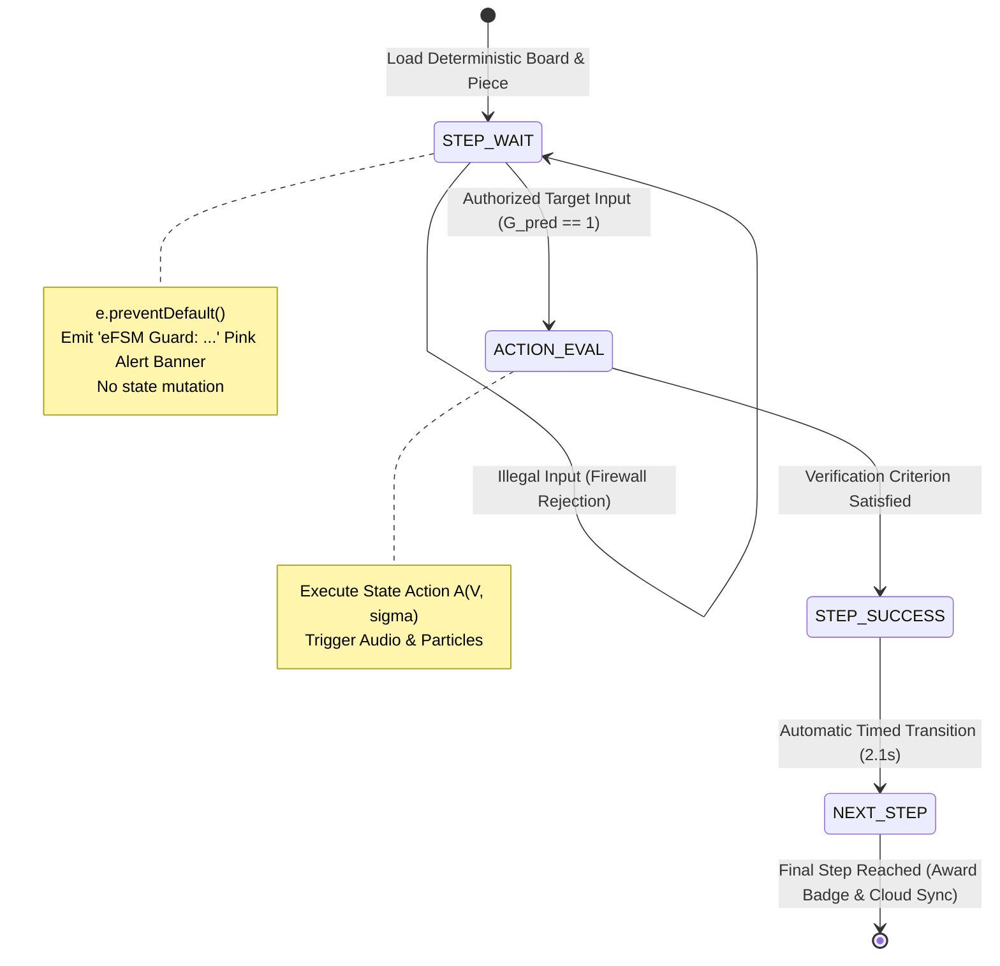
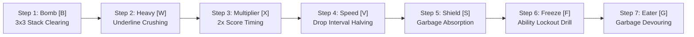
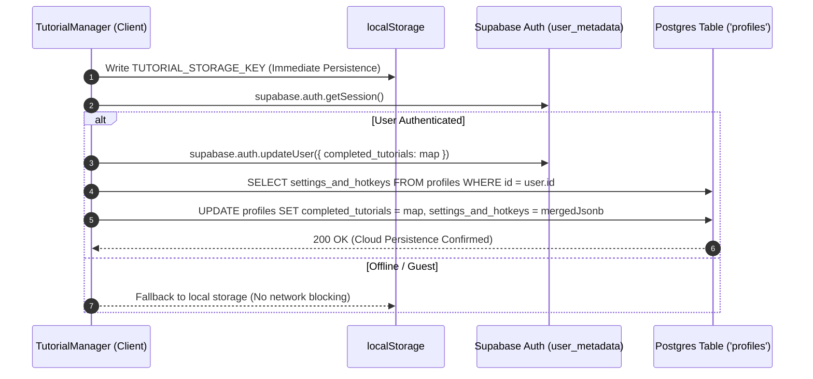

# Pedagogical Onboarding Framework & Interactive Multi-Stage Tutorials in *Cascade Aurelius*

---

## 1. Executive Summary & Pedagogical Philosophy

In classical competitive falling-block puzzle games, onboarding typically relies on static diagram overlays, passive video demonstrations, or unconstrained free-play modes. While sufficient for standard rotational mechanics, this passive approach fails completely in modern asymmetric action games. *Cascade Aurelius* integrates hero classes with unique energy curves, active ability cooldowns ($[\text{Q}], [\text{E}], [\text{R}]$), dynamic target switching, seven special item blocks, and non-linear line-clearing physics. Without a rigorous pedagogical system, novice players experience cognitive overload and high early-game churn.

To solve this, *Cascade Aurelius* introduces a **Comprehensive Pedagogical Onboarding Framework** centered around an interactive, deterministic **Three-Stage Certification Curriculum**:

```
+---------------------------------------------------------------------------------+
|                       CASCADE AURELIUS PEDAGOGICAL CURRICULUM                   |
+---------------------------------------------------------------------------------+
| Stage 1: Core Fundamentals                                                      |
|   - 8-Step Kinematic Automaton (Move, Drop, Hard Drop, Rotate, Hold, Swap Clear)|
|   - Storage ID: 'basics-stage-1'                                                |
+---------------------------------------------------------------------------------+
                                         │
                                         ▼
+---------------------------------------------------------------------------------+
| Stage 2: Hero Class Certifications (4 Distinct Archetypes)                      |
|   - Speedster Certification ('class-cert-SPEEDSTER')                            |
|   - Tank Certification ('class-cert-TANK')                                      |
|   - Saboteur Certification ('class-cert-SABOTEUR')                              |
|   - Support Certification ('class-cert-SUPPORT')                                |
|   - Drills: Passive Tetris -> Passive Item -> Ability [Q] -> [E] -> Ult [R]    |
+---------------------------------------------------------------------------------+
                                         │
                                         ▼
+---------------------------------------------------------------------------------+
| Stage 3: The Seven Special Item Blocks Certification                            |
|   - 7 Discrete Mechanical Mastery Drills                                        |
|   - Bomb [B], Heavy [W], Multiplier [X], Speed [V], Shield [S], Freeze [F],     |
|     Garbage Eater [G]                                                           |
|   - Storage ID: 'stage3_completed'                                              |
+---------------------------------------------------------------------------------+
```

The onboarding engine is governed by two formal software engineering paradigms:
1. **Extended Finite State Machine (eFSM) Input Firewalls:** The runtime strictly intercepts and filters user keystrokes via `e.preventDefault()`, preventing misdrops, premature piece placements, or illegal action sequences that would desynchronize the lesson.
2. **Dual-Layer Cloud Synchronization:** Progress is tracked atomically across client `localStorage`, Supabase Auth user metadata (`user_metadata`), and the relational PostgreSQL `profiles` table.

---

## 2. Formal Automaton Architecture: The eFSM Input Firewall

In unconstrained tutorial environments, a player who presses the wrong key (e.g., executing a hard drop when instructed to rotate) invalidates the board configuration, forcing an awkward reset or breaking the instructional sequence.

*Cascade Aurelius* eliminates this via a formal **Extended Finite State Machine (eFSM)** implemented in [`src/TutorialManager.ts`](file:///c:/Users/destr/Documents/Cascade-Aurelius/Prototype%20V1/src/TutorialManager.ts).

### 2.1 Mathematical Formalism

The tutorial automaton is formalized as a 7-tuple:
$$\mathcal{M}_{\text{tut}} = \big\langle \mathcal{S}, \; S_0, \; \mathcal{V}, \; \Sigma, \; \mathcal{G}_{\text{pred}}, \; \mathcal{A}, \; \delta \big\rangle$$
where:
- $\mathcal{S} = \mathcal{S}_{\text{Stage1}} \cup \mathcal{S}_{\text{Stage2}} \cup \mathcal{S}_{\text{Stage3}}$ represents the discrete instructional states.
- $S_0$ is the initial state of the active lesson.
- $\mathcal{V}$ is the vector of internal runtime context variables:
  $$\mathcal{V} = \big[ \text{grid}, \; \text{currentPiece}, \; \text{classMeter}, \; \text{fortifyCharges}, \; \text{reflectArmed}, \; \text{incomingQueue}, \; \text{dummyBoards[]} \big]$$
- $\Sigma$ is the alphabet of player input events:
  $$\Sigma = \big\{ \text{LEFT}, \text{RIGHT}, \text{SOFT\_DROP}, \text{HARD\_DROP}, \text{ROTATE}, \text{HOLD}, \text{KEY\_Q}, \text{KEY\_E}, \text{KEY\_R} \big\}$$
- $\mathcal{G}_{\text{pred}}: \Sigma \times \mathcal{V} \times \mathcal{S} \to \{0, 1\}$ is the **Input Firewall Guard Predicate**.
- $\mathcal{A}: \mathcal{V} \times \Sigma \to \mathcal{V}'$ is the set of state actions (e.g., board resets, ability triggers, visual banner emissions).
- $\delta: \mathcal{S} \times \Sigma \times \mathcal{V} \to \mathcal{S}'$ is the state transition function.



---

### 2.2 Input Firewall Implementation (`handleKeyDown`)

When a player inputs a keystroke during an active drill, the event enters the firewall:

```typescript
// TutorialManager.ts: handleKeyDown input firewall
if (this.certStep === 'STEP_2_ABILITY') {
  e.preventDefault();
  if (key === 'q' || key === 'Q') {
    // Authorized transition
    this.fortifyCharges = 2;
    this.incomingGarbageQueue = 0;
    this.stage2TransitionLocked = true;
    AudioManager.playSfx('lineClear');
    this.showStage2Banner('✓ FORTIFY! Gained 2 FSM immunity charges and blocked all 10 incoming garbage lines!', 'green');
    setTimeout(() => { this.setupCertStep('STEP_3_ABILITY'); }, 2100);
  } else {
    // Firewall Rejection
    this.showStage2Banner('eFSM Guard: Press [Q] Fortify to gain 2 immunity charges and block the 10-line attack!', 'pink');
  }
  return;
}
```

If an unauthorized input is received, the firewall:
1. Calls `e.preventDefault()` to halt all default browser and game loop processing.
2. Emits a high-contrast pink alert banner (`'eFSM Guard: ...'`) explaining precisely which key is required to progress.
3. Preserves all piece positions, timers, and board states without penalty.

---

## 3. Stage 1: Core Fundamentals (`basics-stage-1`)

Stage 1 guides completely novice players through the fundamental mechanics of falling-block kinematics and piece management across 8 discrete steps:

| Step Identifier | User Action Required | Firewall Guard Predicate $\mathcal{G}_{\text{pred}}$ | Pedagogical Objective |
| :--- | :--- | :--- | :--- |
| `PIECE_1_MOVE` | Press $A / D$ or $\leftarrow / \rightarrow$ | $\sigma \in \{\text{LEFT}, \text{RIGHT}\}$ | Establishes lateral translation. |
| `PIECE_1_SOFT_DROP` | Press $S$ or $\downarrow$ | $\sigma == \text{SOFT\_DROP}$ | Teaches speed-regulated descent. |
| `PIECE_2_HARD_DROP` | Press $W$ or $\text{Space}$ | $\sigma == \text{HARD\_DROP}$ | Instantaneous lock-in and commitment. |
| `PIECE_3_ROTATE` | Press $K$ or $\uparrow$ | $\sigma == \text{ROTATE}$ | Teaches clockwise matrix orientation. |
| `PIECE_4_HOLD` | Press $C$ or $\text{Shift}$ | $\sigma == \text{HOLD}$ | Stashing unwanted shapes for later use. |
| `PIECE_5_DROP_FIRST` | Drop current piece | $\text{linesCleared} == 0 \land \text{isLocked}$ | Seeds the board to demonstrate hold retrieval. |
| `PIECE_5_SWAP_HOLD` | Press $C$ to swap back | $\sigma == \text{HOLD} \land \text{hasHeldPiece}$ | Swapping the held piece back into play. |
| `PIECE_5_DROP_SWAPPED`| Lock swapped piece | $\text{linesCleared} \ge 1$ | Completes the line clear; triggers Stage 1 celebration modal. |

Upon completing Step 8, the system marks `'basics-stage-1'` as completed, emits celebratory confetti, and opens the Stage 2 Class Selection menu.

---

## 4. Stage 2: Hero Class Certification Curriculum

Stage 2 represents the core innovation of *Cascade Aurelius*. Each of the four hero classes—**Speedster**, **Tank**, **Saboteur**, and **Support**—features an asymmetric kit that requires individual certification.

```
       SPEEDSTER                 TANK                 SABOTEUR                SUPPORT
  +------------------+   +------------------+   +------------------+   +------------------+
  | Passive: Speed   |   | Passive: Shield  |   | Passive: Freeze  |   | Passive: Recycle |
  | [Q]: Dash/Sprint |   | [Q]: Fortify     |   | [Q]: Scramble    |   | [Q]: Recycle     |
  | [E]: Time Warp   |   | [E]: Reflect     |   | [E]: Chaos Reverse|  | [E]: Gold Drop   |
  | [R]: Quicksilver |   | [R]: Earthquake  |   | [R]: Glitch Shift|   | [R]: Angel Heals |
  +------------------+   +------------------+   +------------------+   +------------------+
```

Every class certification adheres to a uniform 4-step pedagogical structure:

### 4.1 Step 1: Passive Awakening & Special Block Drill
- **`STEP_1_PASSIVE_TETRIS`:** The player board is loaded with a deterministic 4-row stack featuring a single open well at Column 10 (`loadStandardTetrisWellOnPlayerBoard`). The player is given an I-tetromino and must execute a 4-line clear (Tetris).
  - **Speedster:** Unlocks the Speed passive.
  - **Tank:** Raises the Shield passive.
  - **Saboteur:** Infuses the Freeze passive.
  - **Support:** Recycles matrix garbage.
- **`STEP_1_PASSIVE_SPECIAL`:** A practical follow-up drill demonstrating the mechanical benefit of the passive block triggered in Step 1.

---

### 4.2 Step 2: Class Ability 1 Drill ($[\text{Q}]$)
Focuses on the primary tactical utility skill:
- **Speedster ([Q] Sprint):** Injects a high-speed piece descent onto a dummy opponent board, forcing their piece to drop at $1.5\times$ speed.
- **Tank ([Q] Fortify):** The player is threatened by an incoming 10-line garbage spike. Pressing $[\text{Q}]$ grants 2 Fortify charges, completely absorbing the attack.
- **Saboteur ([Q] Scramble):** Shuffles the dummy opponent's preview queue from a favorable I-piece sequence into an unmanageable sequence ($Z \cdot S \cdot J \cdot Z \cdot S$).
- **Support ([Q] Recycle):** Transmutes 4 rows of raw gray garbage into active special item blocks.

---

### 4.3 Step 3: Class Ability 2 Drill ($[\text{E}]$)
Focuses on defensive counter-play or high-impact tactical disruption:
- **Speedster ([E] Time Warp):** The engine overrides gravity to an extreme, unplayable rate ($\Delta t_{\text{drop}} = 55\text{ms}$). Pressing $[\text{E}]$ slows time by $75\%$ ($\Delta t_{\text{drop}} \leftarrow 800\text{ms}$), allowing clean recovery.
- **Tank ([E] Counter Strike):** When an incoming 10-line attack is queued, pressing $[\text{E}]$ arms reflection. The incoming packet is deflected and redirected onto the dummy opponent's board.
- **Saboteur ([E] Chaos Reverse):** Inverts the dummy opponent's directional controls for $4.0\text{s}$, swapping left and right movement inputs.
- **Support ([E] Gold Drop):** Imbues all 4 cells of the next tetromino with unique special item blocks via Fisher-Yates shuffle.

---

### 4.4 Step 4: Class Ultimate AoE Testbed ($[\text{R}]$)
To demonstrate large-scale multi-target impact, Step 4 dynamically swaps the UI from the single dummy view to the **3-Dummy AoE Lobby** (`tut-multi-dummy-view`):

```typescript
// TutorialManager.ts: setupCertStep()
const isMultiDummyAoE =
  (step === 'STEP_4_ULTIMATE' || step === 'STEP_4_BULLET_TIME_TETRIS') &&
  this.activeClass !== 'SUPPORT';

if (isMultiDummyAoE) {
  singleView?.classList.add('hidden');
  multiView?.classList.remove('hidden'); // Spawns 3 simultaneous dummy opponent boards
}
```

```
                   +------------------------+
                   |   PLAYER HERO BOARD    |
                   |      [R] READY!        |
                   +------------------------+
                               │
            ┌──────────────────┼──────────────────┐
            ▼                  ▼                  ▼
     +--------------+   +--------------+   +--------------+
     | DUMMY POD 1  |   | DUMMY POD 2  |   | DUMMY POD 3  |
     | (Targeted)   |   | (Targeted)   |   | (Targeted)   |
     +--------------+   +--------------+   +--------------+
```

- **Speedster ([R] Quicksilver):** Freezes all 3 dummy boards for $8.0\text{s}$ while granting the player bullet-time placement to score a free Tetris.
- **Tank ([R] Earthquake):** Discharges an AoE shockwave that injects $+4$ raw garbage lines simultaneously into all 3 dummy boards.
- **Saboteur ([R] Glitch):** Shifts all 3 dummy boards horizontally by $3$ columns with edge wrap-around, fragmenting their stacks.
- **Support ([R] Guardian Angel):** Vaporizes 4 garbage lines from an endangered allied board and grants full invulnerability.

Completing Step 4 permanently awards the player the **★ CERTIFIED** class badge (`markClassCertified(classId)`).

---

## 5. Stage 3: The Seven Special Item Blocks Certification (`Stage3Tutorial.ts`)

Implemented in [`src/Stage3Tutorial.ts`](file:///c:/Users/destr/Documents/Cascade-Aurelius/Prototype%20V1/src/Stage3Tutorial.ts), Stage 3 provides a progressive 7-step mastery curriculum certifying players on each individual special item block before competitive matchmaking:



1. **Step 1 (Bomb Block [$\text{B}$]):** Demonstrates the $3 \times 3$ localized blast radius and column-wise downward compaction.
2. **Step 2 (Heavy Block [$\text{W}$]):** Demonstrates row crushing of the row directly beneath the cleared line ($r + 1$).
3. **Step 3 (Multiplier Block [$\text{X}$]):** Teaches retroactive $2\times$ score amplification and combo chasing.
4. **Step 4 (Speed Block [$\text{V}$]):** Demonstrates $-50\%$ falling speed dilation for high-precision micro-placement.
5. **Step 5 (Shield Block [$\text{S}$]):** Blocks an incoming 4-line garbage packet.
6. **Step 6 (Freeze Block [$\text{F}$]):** Fires a cybernetic targeting tether to lock the dummy opponent's $[\text{Q}], [\text{E}], [\text{R}]$ abilities.
7. **Step 7 (Garbage Eater [$\text{G}$]):** Devours 4 rows of garbage from the matrix bottom and awards $+800\text{ PTS}$ flat bonus.

---

## 6. Dual-Layer Cloud Synchronization Architecture

To ensure tutorial mastery persists across sessions and hardware platforms, *Cascade Aurelius* implements a fault-tolerant dual-layer synchronization pipeline interfacing with **Supabase Backend Services**:



### 6.1 Database Schema & Storage Redundancy
1. **Client Storage (`localStorage`):**
   Key: `cascade_completed_tutorials_v1`. Guarantees immediate zero-latency reads during page initialization without waiting for remote API handshakes.
2. **Auth Metadata (`user.user_metadata`):**
   Stores `completed_tutorials: Record<string, boolean>`. Automatically deserialized in the JWT token upon user authentication.
3. **Relational Database (`profiles` Table):**
   Updates both a dedicated JSONB column `completed_tutorials` and a nested property inside `settings_and_hotkeys`:
   ```sql
   UPDATE profiles 
   SET completed_tutorials = '{"basics-stage-1": true, "class-cert-TANK": true, "stage3_completed": true}'::jsonb,
       settings_and_hotkeys = jsonb_set(settings_and_hotkeys, '{completedTutorials}', '{"basics-stage-1": true, ...}'::jsonb)
   WHERE id = 'user-uuid';
   ```

### 6.2 Cloud Hydration Pipeline
When a user logs in, [`hydrateTutorialsFromCloud`](file:///c:/Users/destr/Documents/Cascade-Aurelius/Prototype%20V1/src/TutorialManager.ts#L108-L160) merges cloud state with local storage using an **additive union strategy**:
$$\text{Map}_{\text{final}} = \text{Map}_{\text{local}} \cup \text{Map}_{\text{auth\_meta}} \cup \text{Map}_{\text{profile\_db}}$$
This guarantees that completing a tutorial offline or on a guest account is safely merged into the user's permanent profile upon logging in.

---

## 7. Comparative Analysis: Classical Tutorials vs. *Cascade Aurelius*

| Pedagogical Feature | Standard Falling-Block Game | *Cascade Aurelius* Onboarding Framework |
| :--- | :--- | :--- |
| **Input Governance** | Unconstrained / None | Strict eFSM Input Firewall with Contextual Rejection Banners |
| **Board State Seeding** | Random piece generator (7-bag) | Deterministic hand-crafted matrices & forced piece injections |
| **Hero Mechanics** | Uniform symmetrical pieces | 4-Stage Class Certification per Archetype (Speedster, Tank, Saboteur, Support) |
| **Multi-Target Scaling** | Single-board drills only | Dynamic switching to 3-Dummy AoE Lobby for Ultimate verification |
| **Item Familiarization** | Passive textual descriptions | 7-Step Interactive Verification Curriculum (`Stage3Tutorial.ts`) |
| **Persistence Model** | Local cookies / transient memory | Dual-layer Supabase Auth metadata + PostgreSQL JSONB replication |

---

## 8. Summary Equations & Mathematical Reference

$$\begin{aligned}
\text{Automaton Specification:} \quad & \mathcal{M}_{\text{tut}} = \big\langle \mathcal{S}, \; S_0, \; \mathcal{V}, \; \Sigma, \; \mathcal{G}_{\text{pred}}, \; \mathcal{A}, \; \delta \big\rangle \\
\text{Firewall Filter:} \quad & \text{Process}(\sigma) = \begin{cases} \delta(S, \sigma, \mathcal{V}) & \text{if } \mathcal{G}_{\text{pred}}(\sigma, \mathcal{V}, S) == 1 \\ \text{EmitAlert}(\text{banner}) & \text{if } \mathcal{G}_{\text{pred}}(\sigma, \mathcal{V}, S) == 0 \end{cases} \\
\text{Cloud Hydration Union:} \quad & \mathcal{T}_{\text{active}} = \mathcal{T}_{\text{local}} \cup \mathcal{T}_{\text{meta}} \cup \mathcal{T}_{\text{profiles}} \\
\text{Time Warp Gravity:} \quad & \Delta t_{\text{drop}}(t) = \begin{cases} 55\text{ ms} & \text{pre-warp (unmanageable stress)} \\ 800\text{ ms} & \text{post-warp (time dilation active)} \end{cases}
\end{aligned}$$
