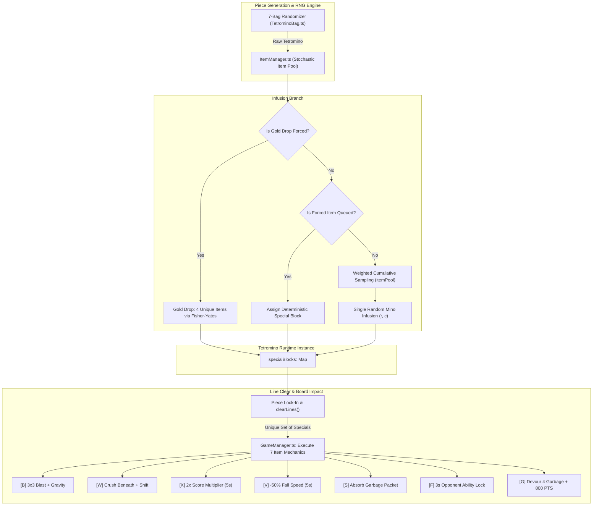
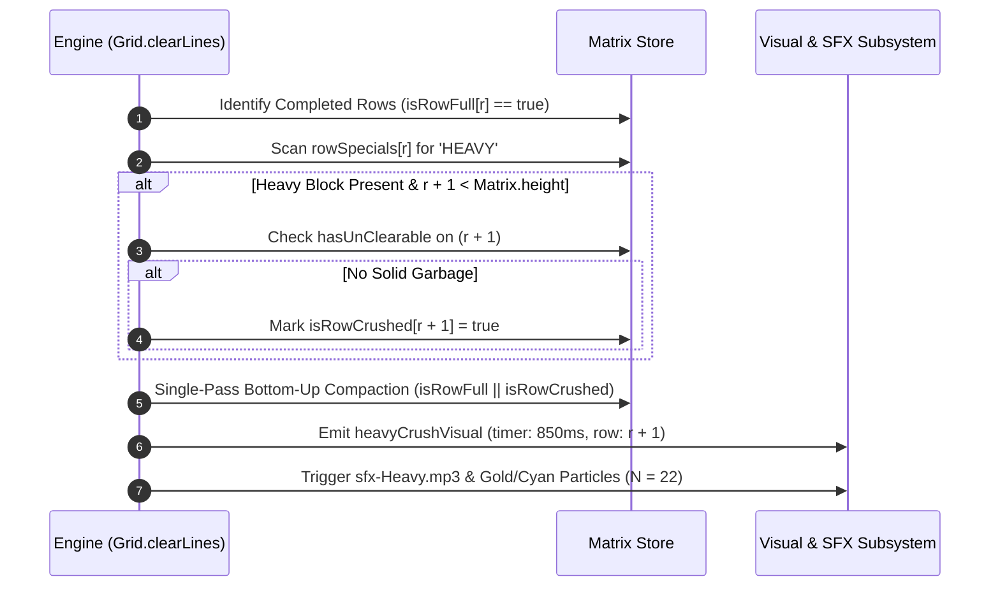
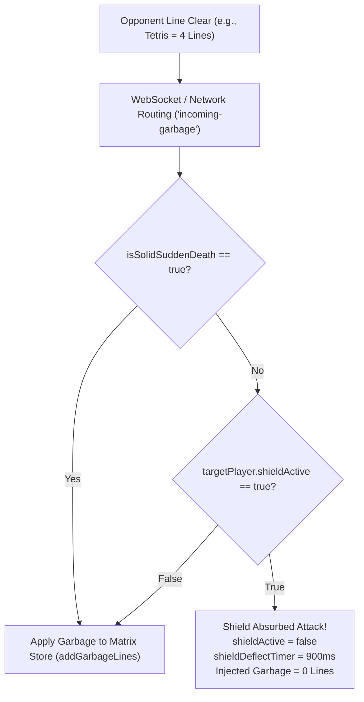
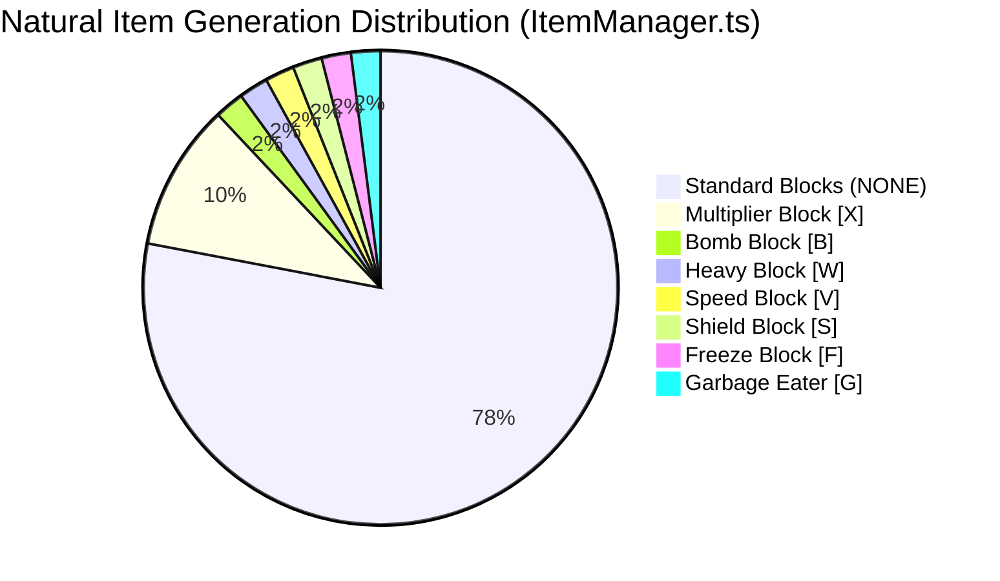
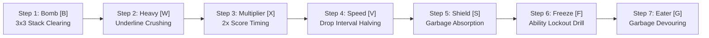

# The Seven Special Item Blocks: Mechanics, Stochastic Generation, and Game Economy in *Cascade Aurelius*

---

## 1. Executive Summary & Foundational Design Philosophy

In classical competitive falling-block puzzle games (e.g., *Tetris*), player interactions are almost exclusively mediated through the symmetrical exchange of raw garbage lines. While mathematically pure, this uniform offensive dynamic often leads to rigid defensive meta-strategies, monotonic play patterns, and limited tactical comeback potential. 

*Cascade Aurelius* fundamentally alters this paradigm through its **Hybrid Item-Economy Engine**. Integrated natively into the standard 7-bag piece generation pipeline, seven distinct **Special Item Blocks** infuse individual tetromino minos with localized, game-altering properties:

1. **Bomb Block [$\text{B}$]:** Spatial area-of-effect destruction ($3 \times 3$ matrix detonation) accompanied by column-wise gravitational compaction.
2. **Heavy Block [$\text{W}$]:** Kinetic kinetic impact that clears the host line and structurally crushes the row directly beneath it.
3. **Multiplier Block [$\text{X}$]:** Temporal economic surge granting a $+2\times$ score amplification window ($5.0\text{s}$) applied retroactively to the activating clear.
4. **Speed Block [$\text{V}$]:** Kinematic temporal dilation reducing falling speed by $50\%$ ($5.0\text{s}$) to facilitate high-precision placement under pressure.
5. **Shield Block [$\text{S}$]:** Impervious reactive barrier that absorbs and neutralizes an entire incoming garbage packet regardless of magnitude.
6. **Freeze Block [$\text{F}$]:** Targeted cybernetic disruption tethering an opponent and locking their active class abilities ($[\text{Q}], [\text{E}], [\text{R}]$) for $3.0\text{s}$.
7. **Garbage Eater [$\text{G}$]:** Alchemical inversion scanning and vaporizing up to 4 garbage rows from the board, transmuting hazardous matrix clutter into $+800\text{ PTS}$ flat bonus score.



---

## 2. The 7 Special Item Blocks: Technical Taxonomy & Physics

Each special block possesses a dedicated sprite asset, glowing hex signature, HUD glyph, audio-visual feedback profile, and strict state-mutation rules implemented within [`src/ItemManager.ts`](file:///c:/Users/destr/Documents/Cascade-Aurelius/Prototype%20V1/src/ItemManager.ts), [`src/Grid.ts`](file:///c:/Users/destr/Documents/Cascade-Aurelius/Prototype%20V1/src/Grid.ts), and [`src/GameManager.ts`](file:///c:/Users/destr/Documents/Cascade-Aurelius/Prototype%20V1/src/GameManager.ts).

### 2.1 Specification Matrix

| Glyph | Special Block Type | Sprite URI | Signature Hex | Sound Effect (`AudioManager`) | Operational Target | Functional Mechanic |
| :---: | :--- | :--- | :---: | :--- | :--- | :--- |
| **`B`** | `SpecialBlockType.BOMB` | `/blocks/bomb.png` | `#FF4444` | `sfx-Bomb.mp3` (`'bomb'`) | Local Matrix ($3 \times 3$) | Radial blast centered at coordinates; column-wise gravity compaction. |
| **`W`** | `SpecialBlockType.HEAVY` | `/blocks/heavy.png` | `#00E5FF` | `sfx-Heavy.mp3` (`'heavy'`) | Local Matrix ($r + 1$) | Crushes the full line directly beneath the cleared row and compacts upper matrix. |
| **`X`** | `SpecialBlockType.MULTIPLIER` | `/blocks/multiplier.png`| `#FFD700` | `sfx-Multiplier.mp3` (`'multiplier'`) | Local Economy | Multiplies all point gains by $2.0\times$ for $5.0\text{s}$; applies retroactively to triggering clear. |
| **`V`** | `SpecialBlockType.SPEED` | `/blocks/speed.png` | `#00FFFF` | `sfx-Speed.mp3` (`'speed'`) | Local Kinematics | Doubles `dropInterval` ($-50\%$ fall speed) for $5.0\text{s}$ for precision piece routing. |
| **`S`** | `SpecialBlockType.SHIELD` | `/blocks/shield.png` | `#00FF88` | `sfx-Shield.mp3` (`'shield'`) | Defense Pipeline | Completely negates the next incoming garbage attack; consumed on impact. |
| **`F`** | `SpecialBlockType.FREEZE` | `/blocks/freeze.png` | `#38BDF8` | `sfx-Freeze.mp3` (`'freeze'`) | Targeted Opponent | Emits cybernetic beam tether; locks opponent $[\text{Q}], [\text{E}], [\text{R}]$ abilities for $3.0\text{s}$. |
| **`G`** | `SpecialBlockType.GARBAGE_EATER` | `/blocks/garbage.png` | `#F59E0B` | `sfx-GarbageEater.mp3` (`'garbageEater'`) | Local Matrix & Score | Deletes up to 4 garbage rows from the bottom; awards $+800\text{ PTS} \times \mu$. |

---

## 3. In-Depth Mechanics & Mathematical Formulations

### 3.1 Bomb Block [$\text{B}$]: Non-Linear Spatial Demolition & Gravitational Compaction

When a row containing a Bomb block completes, the standard line clear executes first. Immediately following line removal, the engine identifies the grid coordinates $(r_{\text{bomb}}, c_{\text{bomb}})$ where the bomb mino was locked.

#### 1. Blast Radius Bounding Box
To prevent index out-of-bounds exceptions along matrix boundaries, the blast center is clamped within the valid inner bounding box:
$$\tilde{r} = \max(1, \min(H - 2, r_{\text{bomb}})), \quad \tilde{c} = \max(1, \min(W - 2, c_{\text{bomb}}))$$
where $H = 20$ (grid height) and $W = 10$ (grid width).

The destroyed coordinate set $\mathcal{C}_{\text{blast}}$ evaluates over a $3 \times 3$ kernel:
$$\mathcal{C}_{\text{blast}} = \Big\{ (r, c) \in \mathbb{N}^2 \;\Big|\; |r - \tilde{r}| \le 1 \land |c - \tilde{c}| \le 1 \land \neg \text{Cell}(r, c).\text{unClearable} \Big\}$$

> [!IMPORTANT]
> The engine strictly respects un-clearable solid garbage injected during Battle Royale Sudden Death phases. If $\text{Cell}(r, c).\text{unClearable} == \text{true}$, the cell survives the explosion, preserving game-ending sudden death tension.

```typescript
// Grid.ts: clearBombArea()
public clearBombArea(centerRow: number, centerCol: number): void {
  const effectiveRow = Math.max(1, Math.min(this.height - 2, centerRow));
  const effectiveCol = Math.max(1, Math.min(this.width - 2, centerCol));
  for (let r = effectiveRow - 1; r <= effectiveRow + 1; r++) {
    for (let c = effectiveCol - 1; c <= effectiveCol + 1; c++) {
      if (r >= 0 && r < this.height && c >= 0 && c < this.width && !this.matrix[r][c].unClearable) {
        this.matrix[r][c] = { type: null };
      }
    }
  }
  this.applyGravity();
}
```

#### 2. Column-Wise Gravitational Compaction (`applyGravity`)
Classical *Tetris* guidelines forbid floating blocks from falling when underneath cells are hollowed out. Because the $3 \times 3$ blast punches a hole directly into the middle of the playfield, *Cascade Aurelius* implements an $O(W \cdot H)$ column-wise gravitational compaction algorithm:

For each column $c \in [0, W - 1]$, two pointer indices (`writeRow` and `readRow`) sweep bottom-up:
$$\text{writeRow} \leftarrow H - 1$$
$$\text{For } \text{readRow} = H - 1 \text{ down to } 0: \quad \text{if } \text{matrix}[\text{readRow}][c].\text{type} \ne \text{null} \implies \begin{cases} \text{matrix}[\text{writeRow}][c] \leftarrow \text{matrix}[\text{readRow}][c] \\ \text{if } \text{writeRow} \ne \text{readRow} \implies \text{matrix}[\text{readRow}][c] \leftarrow \emptyset \\ \text{writeRow} \leftarrow \text{writeRow} - 1 \end{cases}$$

This ensures all disconnected blocks suspended above the detonation settle naturally into the floor, resolving floating block fragmentation.

---

### 3.2 Heavy Block [$\text{W}$]: Dual-Line Kinetic Crushing

The Heavy Block introduces downward kinetic momentum into static line-clearing:

```
Row r     [■][■][■][■][■][W][■][■][■][■]  <-- Line Clear (Full 10/10)
Row r+1   [■][■][ ][■][■][■][■][ ][■][■]  <-- Crushed & Cleared (Even if Incomplete!)
```



#### Compaction Pointer Invariant
The engine unifies normal row clearing and Heavy crushing within a single $O(H)$ bottom-up array copy, ensuring that blocks above both rows fall simultaneously without intermediary physics stalls:
$$\mathcal{R}_{\text{drop}} = \big\{ r \in [0, H - 1] \;\big|\; \text{isRowFull}[r] \lor \text{isRowCrushed}[r] \big\}$$

---

### 3.3 Multiplier Block [$\text{X}$]: Economic Surge Engine

The Multiplier Block doubles all scoring events for $5.0$ seconds ($5{,}000\text{ms}$).

#### Retroactive Actuation Invariant
In naive implementations, clearing a multiplier block row would only apply the $2\times$ bonus to *subsequent* clears. *Cascade Aurelius* explicitly enforces **pre-scoring activation** in [`src/GameManager.ts`](file:///c:/Users/destr/Documents/Cascade-Aurelius/Prototype%20V1/src/GameManager.ts#L1337-L1341):

$$\text{activateMultiplierBlock}() \implies \begin{cases} \mu_{\text{item}} \leftarrow 2 \\ T_{\mu} \leftarrow 5{,}000\text{ ms} \end{cases} \quad \text{\textbf{BEFORE}} \quad \text{addScoreForLines}(L)$$

The total score awarded for the activating clear scales according to the comprehensive scoring equation:
$$S = \Big[ \text{LINE\_SCORES}[\min(4, L)] + \max(0, L - 4) \cdot 200 + 50 \cdot C \Big] \cdot \mu_{\text{item}} \cdot \mu_{\text{global}}$$
where:
- $\text{LINE\_SCORES} = [0, 100, 300, 500, 800]$ for Single, Double, Triple, and Tetris.
- $C$ is the active combo counter ($3.0\text{s}$ decay window).
- $\mu_{\text{item}} = 2.0$ when $T_{\mu} > 0$, else $1.0$.
- $\mu_{\text{global}}$ is the room-level rubber-band or event multiplier.

Furthermore, soft drops ($1\text{ pt/cell}$) and hard drops ($2\text{ pts/cell}$) executed during the $5.0\text{s}$ window also compound with $\mu_{\text{item}}$.

---

### 3.4 Speed Block [$\text{V}$]: Kinematic Temporal Dilation

In fast-paced, high-speed situations, pieces fall with minimal reaction time. The Speed Block provides defensive breathing room by halving falling speed (doubling drop interval).

#### Drop Interval Scaling Mechanics
When the block clears:
1. If no speed buff is active (`speedBlockSlowTimer <= 0`), the drop interval is doubled:
   $$\Delta t_{\text{drop}} \leftarrow \Delta t_{\text{drop}} \cdot 2.0$$
2. The timer is initialized to $5{,}000\text{ms}$:
   $$T_{\text{speed}} \leftarrow 5{,}000\text{ ms}$$
3. During every piece spawn while $T_{\text{speed}} > 0$, newly instantiated tetrominos retain this doubled interval.
4. When $T_{\text{speed}}$ decays to zero during the main update loop ([`src/GameManager.ts#L572-L576`](file:///c:/Users/destr/Documents/Cascade-Aurelius/Prototype%20V1/src/GameManager.ts#L572-L576)):
   $$\Delta t_{\text{drop}} \leftarrow \max(100\text{ ms}, \; \lfloor \Delta t_{\text{drop}} / 2 \rfloor)$$

This creates a $5.0\text{s}$ tactical window allowing players to maneuver complex overhangs, set up T-spins, or downstack without the fear of immediate misdrops.

---

### 3.5 Shield Block [$\text{S}$]: Defensive Garbage Absorption

The Shield Block introduces an absolute defensive hedge against opponent attacks.



#### Garbage Neutralization Pipeline
In [`src/GameManager.ts#L320-L328`](file:///c:/Users/destr/Documents/Cascade-Aurelius/Prototype%20V1/src/GameManager.ts#L320-L328), the shield check precedes all other defensive mitigations (Fortify, Reflect, Recycle):
$$\mathcal{G}_{\text{effective}} = \begin{cases} 0, \quad \text{shieldActive} \leftarrow \text{false} & \text{if } \text{shieldActive} \land \neg \text{isSolidSuddenDeath} \\ \mathcal{G}_{\text{incoming}} & \text{otherwise} \end{cases}$$

- **Single-Player Auto-Decay:** In solo training sessions, the shield aura expires after $1{,}000\text{ms}$ if not struck.
- **Multiplayer State Persistence:** In live 1v1, 3v3 TDM, and Battle Royale matches, the shield aura **persists indefinitely** until broken by an opponent's incoming attack packet.

---

### 3.6 Freeze Block [$\text{F}$]: Offensive Cybernetic Lockout

The Freeze Block is the primary direct-harassment special block, crippling opponent ability rotations.

#### Targeting & Network Replication
Upon line clear, the engine resolves the target opponent:
- **Battle Royale (FFA):** Selects an active survivor uniformly at random:
  $$\text{target} \sim \mathcal{U}\big(\{p \in \text{Players} \mid p \ne \text{self} \land \neg p.\text{isToppedOut}\}\big)$$
- **1v1 & 3v3 TDM:** Focuses the player's manually targeted adversary (`selectedTargetIndex`) or the primary enemy player.

A visual beam tether (`freezeTetherVisual`, duration $650\text{ms}$) connects the two boards on the client canvas. In multiplayer sessions, the client transmits an authoritative payload:
```json
{
  "type": "ABILITY_FREEZE",
  "durationMs": 3000,
  "targetIndex": 2
}
```

#### Client Ability Firewall
On the target machine, the engine assigns:
$$\text{abilityFreezeTimer} \leftarrow 3{,}000\text{ ms}$$

While $\text{abilityFreezeTimer} > 0$, the target player's ability activation pipeline ([`src/GameManager.ts#L968`](file:///c:/Users/destr/Documents/Cascade-Aurelius/Prototype%20V1/src/GameManager.ts#L968)) aborts execution:
$$\text{executeAbility}(\text{slot}) \implies \text{if } (\text{abilityFreezeTimer} > 0) \;\; \mathbf{return}$$

The opponent's $[\text{Q}], [\text{E}], [\text{R}]$ ability badges turn icy blue and frost particles cascade over their board header.

---

### 3.7 Garbage Eater [$\text{G}$]: Threat Transmutation Engine

The Garbage Eater is the premier comeback mechanic in *Cascade Aurelius*. Rather than requiring the player to downstack through garbage row-by-row, it directly devours dirty rows from below.

```
Before Garbage Eater:                     After Garbage Eater:
Row 16: [■][■][■][■][■][■][■][■][■][■]    Row 16: [■][■][■][■][■][■][■][■][■][■]  <-- Line Clear
Row 17: [■][■][■][■][■][G][■][■][■][■]    --------------------------------------
Row 18: [▓][▓][▓][ ][▓][▓][▓][▓][▓][▓]    Row 18: [DEVOURED - VAPORIZED]
Row 19: [▓][ ][▓][▓][▓][▓][▓][▓][▓][▓]    Row 19: [DEVOURED - VAPORIZED]
                                          --> +800 Flat Bonus Points!
                                          --> Column Gravity Compaction Applied
```

#### Garbage Purge Algorithm (`clearGarbageLines`)
The grid scans bottom-up from row $H - 1$ to $0$:
$$\text{cleared} \leftarrow 0$$
$$\forall r \in [H - 1, \dots, 0] \text{ while } \text{cleared} < 4:$$
$$\text{if } \exists c \in [0, W - 1] \text{ such that } \text{matrix}[r][c].\text{type} == \text{'GARBAGE'} \land \neg \text{matrix}[r][c].\text{unClearable} \implies$$
$$\forall c \in [0, W - 1]: \text{matrix}[r][c] \leftarrow \emptyset; \quad \text{cleared} \leftarrow \text{cleared} + 1$$

If $\text{cleared} > 0$, `applyGravity()` runs immediately, collapsing any normal blocks resting above the devoured garbage rows downward.

#### Economic Transmutation
Devouring garbage awards a significant flat score bonus that scales with active multipliers:
$$S_{\text{gained}} = 800 \cdot \mu_{\text{item}} \cdot \mu_{\text{global}}$$
In online play, the client emits a dedicated semantic score event to the authoritative server:
```typescript
this.network.sendScoreEvent('garbage_eater', 0, combo, botId, scoreMultiplier);
```

---

## 4. The Generation Engine & Economy (`ItemManager.ts`)

The item drop system is architected around stochastic balance, deterministic class overrides, and specialized ability infusions.

### 4.1 Stochastic Probability Distribution Table

The standard drop pool in [`src/ItemManager.ts#L44-L53`](file:///c:/Users/destr/Documents/Cascade-Aurelius/Prototype%20V1/src/ItemManager.ts#L44-L53) assigns explicit relative weights:

$$\begin{array}{|l|c|c|r|}
\hline
\textbf{Special Block Type} & \textbf{Pool Weight } w_i & \textbf{Probability } P(i) = \frac{w_i}{\sum w} & \textbf{Role / Economic Purpose} \\
\hline
\text{NONE (Standard Tetromino Mino)} & 78 & 78.0\% & \text{Preserves core falling-block identity} \\
\text{MULTIPLIER [X]} & 10 & 10.0\% & \text{Drives score chasing \& high-risk line clears} \\
\text{BOMB [B]} & 2 & 2.0\% & \text{Rare spatial recovery / overhang unjamming} \\
\text{HEAVY [W]} & 2 & 2.0\% & \text{Rare kinetic offensive downstacking} \\
\text{SPEED [V]} & 2 & 2.0\% & \text{Tactical micro-positioning \& stabilization} \\
\text{SHIELD [S]} & 2 & 2.0\% & \text{Defensive hedge against sudden burst garbage} \\
\text{FREEZE [F]} & 2 & 2.0\% & \text{Targeted tactical ability disruption} \\
\text{GARBAGE EATER [G]} & 2 & 2.0\% & \text{Clutch survival \& comeback potential} \\
\hline
\textbf{Total} & \mathbf{100} & \mathbf{100.0\%} & \mathbf{P(\text{Any Item}) = 22.0\%} \\
\hline
\end{array}$$



> [!NOTE]
> **Economic Design Rationale:** By allocating $10\%$ weight to the Multiplier Block and restricting all direct board-altering or offensive blocks to $2\%$ each, the meta avoids item spam while maintaining high-impact moments when combat items appear.

---

### 4.2 Tetromino Infusion Pipeline

A standard tetromino consists of 4 solid minos. In natural generation, only **one** solid mino within the falling tetromino is infused with an item.

```typescript
// ItemManager.ts: applySpecificItemToTetromino()
public applySpecificItemToTetromino(tetromino: Tetromino, itemType: SpecialBlockType): void {
  if (itemType === SpecialBlockType.NONE) return;

  const solidBlocks: { r: number; c: number }[] = [];
  for (let r = 0; r < tetromino.matrix.length; r++) {
    for (let c = 0; c < tetromino.matrix.length; c++) {
      if (tetromino.matrix[r][c] !== 0) solidBlocks.push({ r, c });
    }
  }
  if (!solidBlocks.length) return;
  const target = solidBlocks[Math.floor(Math.random() * solidBlocks.length)];
  tetromino.specialBlocks.set(`${target.r},${target.c}`, itemType);
}
```

The location is keyed by relative coordinate string `"r,c"`. When a player rotates or holds the piece, the mapping is preserved across orientations and hold swaps.

---

### 4.3 Support Class Synergies: Gold Drop & Garbage Recycling

The hero class architecture deeply intersects with the item economy, notably through the **Support** class:

#### 1. Ultimate Ability [E]: "Gold Drop"
When Support triggers Gold Drop, `forceGoldDropNext()` flags the next spawned tetromino. Instead of infusing a single cell, **every solid mino** (all 4 cells) is infused with a distinct, unique special block selected via **Fisher-Yates Shuffle**:

$$\text{Pool} = \big[ \text{BOMB}, \text{HEAVY}, \text{MULTIPLIER}, \text{SPEED}, \text{SHIELD}, \text{FREEZE}, \text{GARBAGE\_EATER} \big]$$

```typescript
// ItemManager.ts: applyGoldDropToTetromino()
// Fisher-Yates shuffle to pick unique item blocks
for (let i = uniquePool.length - 1; i > 0; i--) {
  const j = Math.floor(Math.random() * (i + 1));
  [uniquePool[i], uniquePool[j]] = [uniquePool[j], uniquePool[i]];
}

tetromino.specialBlocks.clear();
solidBlocks.forEach((cell, idx) => {
  const itemType = uniquePool[idx % uniquePool.length];
  tetromino.specialBlocks.set(`${cell.r},${cell.c}`, itemType);
});
```

A single line clear containing this super-piece triggers up to 4 simultaneous item mechanics, creating a massive swing in match momentum.

#### 2. Ability [Q]: "Recycle" & Tetris Passives
The Support class can convert dirty gray garbage cells residing on their board directly into active special blocks cycling through all 7 types:
```typescript
// Grid.ts: convertGarbageToSpecialBlocks()
public convertGarbageToSpecialBlocks(count: number): number {
  const specials = ['BOMB', 'HEAVY', 'MULTIPLIER', 'SPEED', 'SHIELD', 'FREEZE', 'GARBAGE_EATER'];
  let converted = 0;
  for (let r = this.height - 1; r >= 0 && converted < count; r--) {
    for (let c = 0; c < this.width && converted < count; c++) {
      const cell = this.matrix[r][c];
      if (cell.type !== 'GARBAGE' || cell.unClearable) continue;
      cell.type = 'I';
      cell.special = specials[converted % specials.length];
      converted++;
    }
  }
  return converted;
}
```

---

### 4.4 Class Passive Item Guarantees

Whenever a player executes a 4-line clear (Tetris), their class archetype guarantees a specific special block on their next piece:

| Class Archetype | 4-Line Clear Passive Effect | Code Invocation |
| :--- | :--- | :--- |
| **Speedster** | Guarantees **Speed Block [$\text{V}$]** on next piece. | `applySpecificItemToTetromino(next, SpecialBlockType.SPEED)` |
| **Tank** | Guarantees **Shield Block [$\text{S}$]** on next piece. | `applySpecificItemToTetromino(next, SpecialBlockType.SHIELD)` |
| **Saboteur** | Guarantees **Freeze Block [$\text{F}$]** on next piece. | `applySpecificItemToTetromino(next, SpecialBlockType.FREEZE)` |
| **Support** | Converts 4 matrix garbage lines into special blocks. | `convertGarbageToSpecialBlocks(4)` |

---

## 5. Client-Side Canvas Rendering & Particle Pipeline

In [`src/lobby.ts`](file:///c:/Users/destr/Documents/Cascade-Aurelius/Prototype%20V1/src/lobby.ts#L1172-L1180), special blocks feature dedicated rendering passes ensuring high visual clarity across all board scales (from $30\text{px}$ primary boards down to $6\text{px}$ Battle Royale mini-boards).

### 5.1 Multi-Layered Block Shader Emulation

For every cell where `cell.special` is defined:
1. **Base Block Texture:** The host tetromino color or sprite renders first.
2. **Special Icon Blitting:** The $1:1$ sprite image (`SPECIAL_BLOCK_SPRITES[type]`) is drawn directly over the cell face with source alpha blending.
3. **Outer Glow Pass:**
   ```typescript
   const glowColor = SPECIAL_BLOCK_COLORS[specialType] || '#FFD700';
   targetCtx.save();
   targetCtx.shadowColor = glowColor;
   targetCtx.shadowBlur = blockSize >= 20 ? 8 : 4;
   targetCtx.strokeStyle = glowColor;
   targetCtx.lineWidth = blockSize >= 20 ? 1.5 : 1;
   targetCtx.strokeRect(finalX, finalY, blockSize, blockSize);
   targetCtx.restore();
   ```
4. **Fallback Typography Glyph:** If sprite assets fail to load or on high-DPI mini-boards, the engine paints the centered bold glyph (`B`, `W`, `X`, `V`, `S`, `F`, `G`) using crisp canvas text baselines.

```
+-------------------+
|  [ GLOW BORDER ]  |
|     +-------+     |
|     | ICON  |     |
|     |  [X]  |     |
|     +-------+     |
|   SHADOW BLUR 8px |
+-------------------+
```

---

## 6. Pedagogical Onboarding Framework (`Stage3Tutorial.ts`)

To ensure players master the strategic depth of all seven blocks, *Cascade Aurelius* incorporates a dedicated 7-step interactive certification drill in [`src/Stage3Tutorial.ts`](file:///c:/Users/destr/Documents/Cascade-Aurelius/Prototype%20V1/src/Stage3Tutorial.ts).



Each stage constructs a deterministic board state where the player is presented with a pre-seeded tetromino containing the target block, requiring them to execute the mechanic correctly before progressing. Upon Step 7 completion, the player's account profile is updated in Supabase cloud storage (`stage3_completed: true`).

---

## 7. Comparative Gameplay Economy: Classical Tetris vs. *Cascade Aurelius*

| Dimension | Classical Competitive *Tetris* | *Cascade Aurelius* Hybrid Item Economy |
| :--- | :--- | :--- |
| **Offensive Diversity** | Symmetrical garbage lines only. | Variable garbage + Freeze ability locks + Heavy line crushes. |
| **Defensive Options** | Downstacking and line-clearing cancels. | Shield absorption + Garbage Eater vaporization + Support recycling. |
| **Comeback Mechanic** | High-risk downstacking through dirty holes. | Tactical Garbage Eater conversion ($+800\text{ PTS}$) and Bomb clearing. |
| **Scoring Dimension** | Linear / polynomial line clears and combos. | Synergistic Multiplier windows ($2\times$) compound with combos and drops. |
| **Piece Asymmetry** | Identical minos within 7-bag. | $22\%$ natural special mino infusion; 100% 4-mino Gold Drop supers. |
| **Pacing Curves** | Monotonically increasing drop speed. | Speed blocks dynamically modulate tempo ($-50\%$ fall speed). |

---

## 8. Summary Equations & Mathematical Reference

$$\begin{aligned}
\text{Total Item Probability:} \quad & P(\text{Item}) = \sum_{i \in \text{Specials}} \frac{w_i}{\sum_{k} w_k} = \frac{22}{100} = 0.22 \\
\text{Scoring Formula:} \quad & S = \Big( \text{LINE\_SCORES}[L] + \max(0, L - 4) \cdot 200 + 50 \cdot C \Big) \cdot \mu_{\text{item}} \cdot \mu_{\text{global}} \\
\text{Garbage Devourer Bonus:} \quad & S_{\text{eater}} = 800 \cdot \mu_{\text{item}} \cdot \mu_{\text{global}} \\
\text{Kinetic Crushed Rows:} \quad & \mathcal{R}_{\text{crushed}} = \big\{ r + 1 \;\big|\; r \in \mathcal{R}_{\text{full}} \land \text{hasHeavy}(r) \land \neg \text{unClearable}(r+1) \big\} \\
\text{Bomb Kernel:} \quad & \mathcal{C}_{\text{blast}} = [r-1, r+1] \times [c-1, c+1] \setminus \{ (r, c) \mid \text{unClearable}(r, c) \}
\end{aligned}$$
